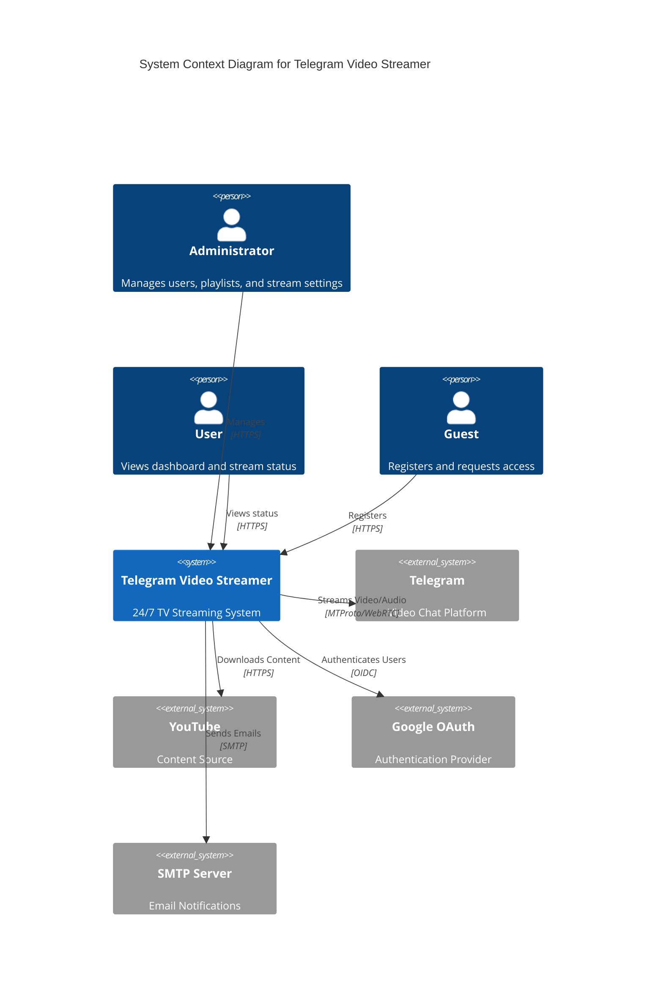
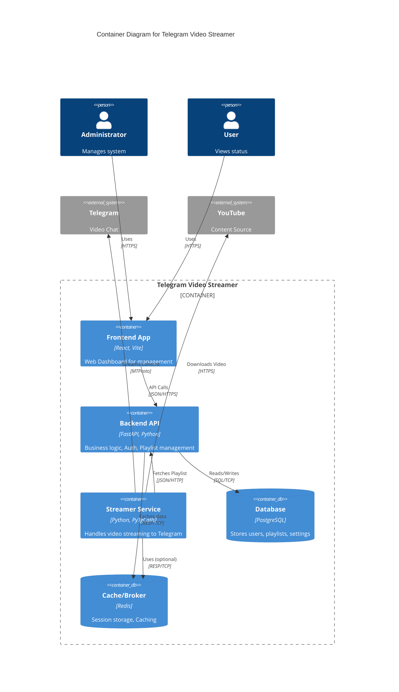
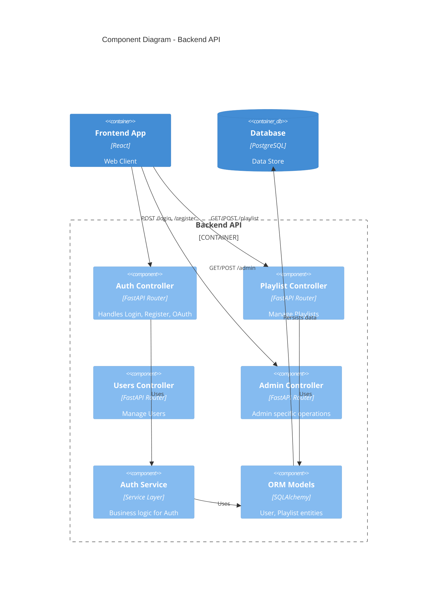
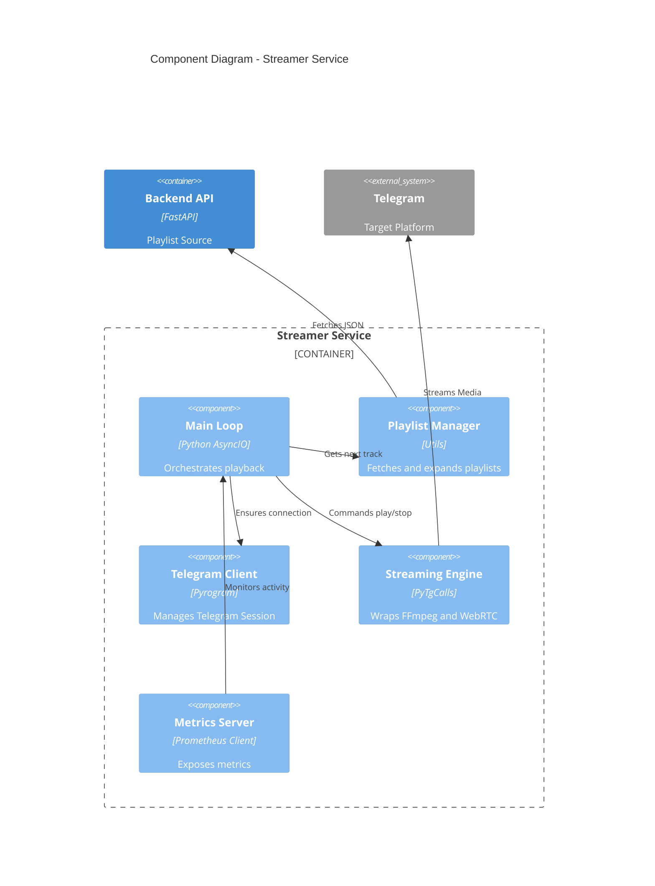

# Архитектура проекта (C4 Model)

**Версия документа**: 1.0
**Дата создания**: 26.11.2025

## 1. System Context Diagram (Уровень 1)

Диаграмма контекста показывает, как система взаимодействует с внешним миром.

## 2. Container Diagram (Уровень 2)

Диаграмма контейнеров показывает основные приложения и сервисы.

## 3. Component Diagram - Backend (Уровень 3)

Детализация Backend API.

## 4. Component Diagram - Streamer (Уровень 3)

Детализация сервиса стриминга.

