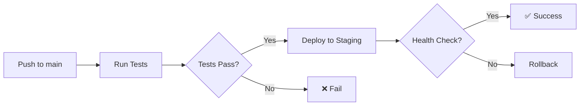

# CD Pipeline — Continuous Deployment

## Обзор

CD pipeline автоматически деплоит приложение на VPS (37.53.91.144) при merge в main ветку.

## Workflow: `.github/workflows/cd.yml`

### Triggers

| Event | Environment | Approval |
|-------|-------------|----------|
| Push to main | staging | Автоматически |
| workflow_dispatch (staging) | staging | Автоматически |
| workflow_dispatch (production) | production | Требуется approval |

### Jobs

1. **test** — Запуск тестов перед деплоем
2. **deploy-staging** — Автоматический деплой на staging
3. **deploy-production** — Деплой на production с approval gate

## Environments

### Staging

- **URL**: http://37.53.91.144:3000
- **Триггер**: Автоматически при push в main
- **Rollback**: Автоматический при failed health check

### Production

- **URL**: http://37.53.91.144:3000
- **Триггер**: Manual workflow_dispatch
- **Approval**: Требуется approval от maintainer
- **Backup**: Автоматический backup БД перед деплоем

## Secrets

Необходимые GitHub Secrets:

| Secret | Описание |
|--------|----------|
| `SSH_PRIVATE_KEY` | SSH ключ для подключения к VPS |

### Настройка SSH ключа

```bash
# Генерация SSH ключа (если нет)
ssh-keygen -t ed25519 -C "github-actions-deploy"

# Копирование публичного ключа на VPS
ssh-copy-id -i ~/.ssh/id_ed25519.pub root@37.53.91.144

# Добавление приватного ключа в GitHub Secrets
# Settings → Secrets and variables → Actions → New repository secret
# Name: SSH_PRIVATE_KEY
# Value: содержимое ~/.ssh/id_ed25519
```

## Процесс деплоя



### Шаги деплоя

1. Сохранение текущего commit для rollback
2. `git pull origin main`
3. `docker compose pull`
4. `docker compose up -d --build`
5. Health check (`/health` endpoint)
6. Автоматический rollback при failure

## Rollback

### Автоматический rollback

При failed health check workflow автоматически:
1. Возвращается к предыдущему commit
2. Перестраивает контейнеры
3. Завершается с ошибкой

### Ручной rollback

```bash
# SSH на VPS
ssh root@37.53.91.144

# Перейти в директорию проекта
cd /root/telegram-broadcast

# Посмотреть предыдущий commit
cat .previous_commit

# Rollback к предыдущей версии
git checkout $(cat .previous_commit)
docker compose up -d --build

# Или использовать скрипт
./scripts/rollback_release.sh
```

### Rollback к конкретной версии

```bash
# Найти нужный commit
git log --oneline -10

# Откатиться к конкретному commit
git checkout <commit_hash>
docker compose up -d --build
```

## Мониторинг

### Health Check

После деплоя проверяется endpoint:
```bash
curl http://localhost:8000/health
```

Ожидаемый ответ:
```json
{
  "status": "healthy",
  "dependencies": [
    {"name": "database", "status": "up"},
    {"name": "redis", "status": "up"}
  ]
}
```

### Логи

```bash
# Все логи
docker compose logs -f

# Логи конкретного сервиса
docker compose logs -f backend

# Последние 100 строк
docker compose logs --tail=100
```

## Troubleshooting

### Деплой завершился с ошибкой

1. Проверить логи в GitHub Actions
2. SSH на VPS и проверить состояние контейнеров:
   ```bash
   docker compose ps
   docker compose logs --tail=50
   ```
3. При необходимости — ручной rollback

### Контейнер не стартует

```bash
# Проверить статус
docker compose ps

# Посмотреть логи проблемного контейнера
docker compose logs backend

# Попробовать пересобрать
docker compose up -d --build --force-recreate backend
```

### База данных недоступна

```bash
# Проверить контейнер БД
docker compose logs db

# Проверить подключение
docker compose exec db pg_isready -U postgres
```

## Best Practices

1. **Не деплоить в пятницу вечером** — меньше людей для реагирования на проблемы
2. **Проверять тесты локально** перед push в main
3. **Использовать feature branches** для разработки
4. **Production деплой только с approval** — минимум один reviewer
5. **Регулярные backups** — автоматически перед production деплоем
