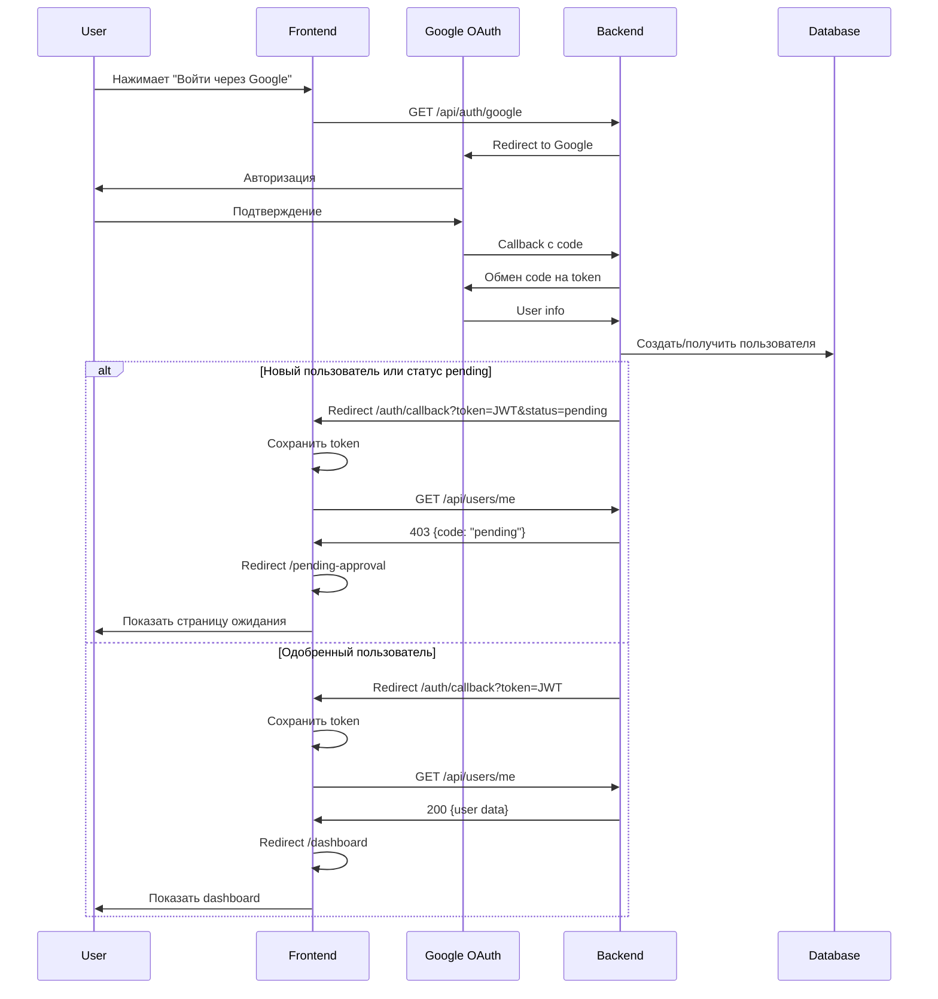

# OAuth Flow и Pending Approval - Документация разработчика

**Дата создания:** 2025-12-23  
**Версия:** 1.0  
**Автор:** Development Team

---

## 📋 Оглавление

1. [Обзор процесса](#обзор-процесса)
2. [Архитектура компонентов](#архитектура-компонентов)
3. [Backend OAuth Flow](#backend-oauth-flow)
4. [Frontend OAuth Flow](#frontend-oauth-flow)
5. [Pending Approval Mechanism](#pending-approval-mechanism)
6. [Автоматическое одобрение](#автоматическое-одобрение)
7. [Ключевые файлы](#ключевые-файлы)
8. [Тестирование](#тестирование)
9. [Типичные проблемы](#типичные-проблемы)

---

## Обзор процесса

### Общий Flow



---

## Архитектура компонентов

### Backend Components

```
backend/src/api/auth/
├── oauth.py                  # OAuth endpoints (/google, /callback)
├── services/
│   └── auth_service.py      # get_or_create_user(), create_jwt_for_user()
└── users.py                 # /api/users/me endpoint
```

### Frontend Components

```
frontend/src/
├── pages/
│   ├── AuthCallback.tsx         # Обработка OAuth callback
│   ├── PendingApprovalPage.tsx  # Страница ожидания подтверждения
│   └── AuthPage3D.tsx          # Главная страница входа
├── context/
│   └── AuthContext.tsx         # Управление состоянием аутентификации
├── hooks/
│   └── useTelegramAuth.ts     # Telegram OAuth hook
└── i18n.ts                    # Переводы (тексты сообщений)
```

---

## Backend OAuth Flow

### 1. Инициация OAuth (/api/auth/google)

**Файл:** `backend/src/api/auth/oauth.py`

```python
@router.get("/google")
async def google_auth(request: Request):
    # Генерация state для защиты от CSRF
    state = secrets.token_urlsafe(32)
    signed_state = sign_state(state)
    
    # Создание authorization URL
    google = OAuth2Session(GOOGLE_CLIENT_ID, redirect_uri=REDIRECT_URI)
    authorization_url, _ = google.authorization_url(
        AUTH_URL,
        access_type="offline",
        prompt="select_account",
        state=state
    )
    
    # Сохранение state в cookie
    response = RedirectResponse(authorization_url)
    response.set_cookie("oauth_state", signed_state, max_age=600, httponly=True)
    return response
```

**Важно:**
- State подписывается для защиты от CSRF
- Cookie используется для проверки state при callback
- `max_age=600` (10 минут) - время жизни state

### 2. OAuth Callback (/api/auth/google/callback)

**Файл:** `backend/src/api/auth/oauth.py`

```python
@router.get("/callback")
async def google_callback(request: Request, db: Session = Depends(get_db)):
    # 1. Проверка state
    callback_state = request.query_params.get('state', '')
    cookie_signed_state = request.cookies.get('oauth_state', '')
    is_valid, original_state = verify_state(cookie_signed_state)
    
    if not is_valid or original_state != callback_state:
        return RedirectResponse(url=f'{frontend_url}/login?error=state_mismatch')
    
    # 2. Обмен code на token
    google.fetch_token(TOKEN_URL, client_secret=GOOGLE_CLIENT_SECRET, ...)
    
    # 3. Получение user info
    user_info = google.get("https://www.googleapis.com/oauth2/v1/userinfo").json()
    
    # 4. Создание/получение пользователя
    result = auth_service.get_or_create_user(db, user_info=user_info)
    user, created = result
    
    # 5. КРИТИЧНО: Проверка статуса
    user_status = getattr(user, 'status', 'active')
    
    if created or user_status not in ('active', 'approved'):
        # Новый или pending пользователь
        temp_token = auth_service.create_jwt_for_user(user)
        notify_admins_async(user.id)  # Уведомление администраторов
        return RedirectResponse(
            url=f"{frontend_url}/auth/callback?token={temp_token}&status=pending"
        )
    
    # 6. Одобренный пользователь
    jwt_token = auth_service.create_jwt_for_user(user)
    return RedirectResponse(url=f"{frontend_url}/auth/callback?token={jwt_token}")
```

**Ключевые моменты:**
- `status=pending` параметр добавляется ТОЛЬКО для неодобренных пользователей
- JWT токен выдается ВСЕГДА (даже для pending), но `/api/users/me` вернет 403
- `notify_admins_async()` отправляет уведомление администраторам

### 3. Проверка статуса пользователя (/api/users/me)

**Файл:** `backend/src/api/users.py`

```python
@router.get("/me", response_model=UserResponse)
async def get_current_user(current_user: User = Depends(get_current_user_with_optional_approval)):
    user_status = getattr(current_user, 'status', 'active')
    
    # Проверка статуса
    if user_status not in ('active', 'approved'):
        if user_status == 'pending':
            raise HTTPException(
                status_code=403,
                detail={
                    "code": "pending",
                    "message": "Аккаунт ожидает подтверждения администратором"
                }
            )
        elif user_status == 'rejected':
            raise HTTPException(
                status_code=403,
                detail={
                    "code": "rejected",
                    "message": "Доступ отклонен администратором"
                }
            )
    
    return UserResponse.from_orm(current_user)
```

**Важно:**
- Возвращает 403 с `code: "pending"` для неодобренных пользователей
- Frontend использует этот код для определения состояния

---

## Frontend OAuth Flow

### 1. Обработка OAuth Callback

**Файл:** `frontend/src/pages/AuthCallback.tsx`

```typescript
const AuthCallback: React.FC = () => {
  const [searchParams] = useSearchParams();
  const { login } = useAuth();
  
  useEffect(() => {
    const token = searchParams.get('token');
    const status = searchParams.get('status');  // КРИТИЧНО!
    
    const handleLogin = async (token: string) => {
      await login(token);  // Сохраняет token и вызывает checkAuth()
      
      // Проверка статуса
      if (status === 'pending') {
        navigate('/pending-approval', { replace: true });
        return;
      }
      
      navigate('/dashboard', { replace: true });
    };
    
    if (token) {
      handleLogin(token);
    }
  }, [searchParams]);
}
```

**Ключевой параметр:**
- `status=pending` - определяет куда редиректить пользователя
- **БЕЗ этого параметра** пользователь всегда попадет на dashboard, даже если pending!

### 2. AuthContext и проверка статуса

**Файл:** `frontend/src/context/AuthContext.tsx`

```typescript
const checkAuth = useCallback(async () => {
  const token = localStorage.getItem('token');
  
  try {
    // Запрос к /api/users/me
    const response = await api.get('/users/me');
    const userData = response.data;
    
    setUser(userData);
    setIsAuthenticated(true);
    setIsPendingApproval(false);
    
  } catch (error: any) {
    // Обработка 403 pending
    if (error?.response?.status === 403) {
      const detail = error?.response?.data?.detail;
      
      if (detail && detail.code === 'pending') {
        setIsPendingApproval(true);  // КРИТИЧНО!
        setIsAuthenticated(false);
        // Токен НЕ удаляется - будет использован для проверки
        return;
      }
    }
    
    // Другие ошибки - разлогин
    logout();
  }
}, []);
```

**Состояния:**
- `isAuthenticated=true` - пользователь одобрен
- `isPendingApproval=true` - пользователь ожидает одобрения
- Оба `false` - не авторизован

---

## Pending Approval Mechanism

### Страница ожидания подтверждения

**Файл:** `frontend/src/pages/PendingApprovalPage.tsx`

```typescript
const PendingApprovalPage: React.FC = () => {
  const { isPendingApproval, refreshUser } = useAuth();
  const [isChecking, setIsChecking] = useState(false);
  
  // 1. Автоматический редирект при одобрении
  useEffect(() => {
    if (!isLoading && isAuthenticated && !isPendingApproval) {
      navigate('/dashboard', { replace: true });
    }
  }, [isAuthenticated, isPendingApproval]);
  
  // 2. Автоматическая проверка каждые 10 секунд
  useEffect(() => {
    if (!isPendingApproval) return;
    
    const interval = setInterval(() => {
      refreshUser();  // Вызывает checkAuth() из AuthContext
    }, 10000);
    
    return () => clearInterval(interval);
  }, [isPendingApproval, refreshUser]);
  
  // 3. Ручная проверка статуса
  const handleCheckStatus = async () => {
    setIsChecking(true);
    await refreshUser();
    setTimeout(() => setIsChecking(false), 1000);
  };
  
  return (
    <div>
      <h1>{t('pending_approval_title', 'Ожидание подтверждения')}</h1>
      <p>{t('pending_approval_message', 'Ваш аккаунт успешно создан...')}</p>
      
      <button onClick={handleCheckStatus}>
        {isChecking ? 'Проверяем...' : 'Проверить статус'}
      </button>
    </div>
  );
};
```

### Переводы текстов

**Файл:** `frontend/src/i18n.ts`

```typescript
const resources = {
  ru: {
    translation: {
      "pending_approval_title": "Ожидание подтверждения",
      "pending_approval_message": "Ваш аккаунт успешно создан и ожидает подтверждения администратором. Мы уведомим вас, когда доступ будет предоставлен.",
      "pending_approval_info": "Обычно проверка занимает несколько часов. Вы можете закрыть эту страницу.",
      "check_status": "Проверить статус",
      "checking": "Проверяем...",
      "back_to_login": "Вернуться на страницу входа"
    }
  }
};
```

**ВАЖНО:** При изменении текстов нужно обновлять ТОЛЬКО i18n.ts, компонент использует `t()` функцию!

---

## Автоматическое одобрение

### Как работает автологин после одобрения

1. **Администратор одобряет пользователя** (меняет status='pending' → 'active')
2. **Следующая проверка статуса:**
   - Автоматическая (каждые 10 секунд)
   - Или ручная (кнопка "Проверить статус")
3. **Backend возвращает 200 вместо 403**
4. **AuthContext обновляет состояние:**
   ```typescript
   setIsAuthenticated(true);
   setIsPendingApproval(false);
   ```
5. **PendingApprovalPage детектирует изменение:**
   ```typescript
   useEffect(() => {
     if (isAuthenticated && !isPendingApproval) {
       navigate('/dashboard');  // Автоматический редирект!
     }
   }, [isAuthenticated, isPendingApproval]);
   ```

**Без перезагрузки страницы!** Пользователь автоматически попадает в dashboard.

---

## Ключевые файлы

### Backend

| Файл | Описание | Что редактировать |
|------|----------|-------------------|
| `backend/src/api/auth/oauth.py` | OAuth endpoints | Логика редиректов, параметр `status=pending` |
| `backend/src/api/users.py` | User endpoints | Проверка статуса, коды ошибок 403 |
| `backend/src/services/auth_service.py` | Auth logic | Создание пользователей, JWT токены |
| `backend/.env` | Environment | `FRONTEND_URL`, `GOOGLE_REDIRECT_URI` |

### Frontend

| Файл | Описание | Что редактировать |
|------|----------|-------------------|
| `frontend/src/pages/AuthCallback.tsx` | OAuth callback handler | Логика проверки `status=pending` |
| `frontend/src/pages/PendingApprovalPage.tsx` | Pending page | UI, автопроверка, редирект |
| `frontend/src/context/AuthContext.tsx` | Auth state | `isPendingApproval`, `checkAuth()` |
| `frontend/src/i18n.ts` | Translations | **Все тексты** |
| `frontend/.env.production` | Build config | `VITE_API_BASE_URL` для production |

---

## Тестирование

### Сценарий 1: Новый пользователь

1. Очистить localStorage: `localStorage.clear()`
2. Перейти на `/login`
3. Нажать "Войти через Google"
4. Авторизоваться в Google
5. **Ожидаемое:** Редирект на `/pending-approval`
6. **Проверить:**
   - Сообщение "Ваш аккаунт успешно создан..."
   - Кнопка "Проверить статус" работает
   - В консоли: `isPendingApproval=true`

### Сценарий 2: Автоматическое одобрение

1. Находясь на `/pending-approval`
2. В админ-панели одобрить пользователя (status → 'active')
3. Подождать 10 секунд (или нажать "Проверить статус")
4. **Ожидаемое:** Автоматический редирект на `/dashboard`
5. **Проверить:**
   - URL изменился на `/dashboard`
   - Отображается dashboard с данными пользователя
   - В консоли: `isAuthenticated=true, isPendingApproval=false`

### Сценарий 3: Одобренный пользователь

1. Пользователь уже одобрен (status='active')
2. Перейти на `/login`
3. Нажать "Войти через Google"
4. **Ожидаемое:** Прямой редирект на `/dashboard` (без pending)
5. **Проверить:** НЕТ параметра `status=pending` в URL callback

---

## Типичные проблемы

### Проблема 1: Пользователь не попадает на pending-approval

**Симптомы:**
- После OAuth логина редирект на `/dashboard` вместо `/pending-approval`
- Пользователь видит пустую страницу или ошибку 403

**Причины:**
1. Backend НЕ добавляет `status=pending` в redirect URL
2. Frontend НЕ проверяет параметр `status` в AuthCallback
3. Backend возвращает JWT без проверки статуса

**Решение:**
```python
# backend/src/api/auth/oauth.py - ОБЯЗАТЕЛЬНО!
if created or user_status not in ('active', 'approved'):
    temp_token = auth_service.create_jwt_for_user(user)
    return RedirectResponse(
        url=f"{frontend_url}/auth/callback?token={temp_token}&status=pending"
    )
```

```typescript
// frontend/src/pages/AuthCallback.tsx - ОБЯЗАТЕЛЬНО!
const status = searchParams.get('status');
if (status === 'pending') {
  navigate('/pending-approval', { replace: true });
  return;
}
```

### Проблема 2: Тексты не обновляются

**Симптомы:**
- Изменили текст в PendingApprovalPage.tsx, но не видно на странице

**Причина:**
- Тексты захардкожены в компоненте, вместо i18n

**Решение:**
```typescript
// ❌ НЕПРАВИЛЬНО
<p>Ваш аккаунт успешно создан...</p>

// ✅ ПРАВИЛЬНО
<p>{t('pending_approval_message', 'Fallback text')}</p>
```

Все тексты должны быть в `frontend/src/i18n.ts`!

### Проблема 3: Автопроверка не работает

**Симптомы:**
- После одобрения пользователь не редиректится автоматически
- Нужно обновлять страницу вручную

**Причина:**
- Не работает polling (setInterval)
- Не срабатывает useEffect с редиректом

**Решение:**
```typescript
// Проверить оба useEffect в PendingApprovalPage.tsx:

// 1. Автопроверка каждые 10 секунд
useEffect(() => {
  if (!isPendingApproval) return;
  const interval = setInterval(() => refreshUser(), 10000);
  return () => clearInterval(interval);
}, [isPendingApproval, refreshUser]);

// 2. Автоматический редирект
useEffect(() => {
  if (isAuthenticated && !isPendingApproval) {
    navigate('/dashboard', { replace: true });
  }
}, [isAuthenticated, isPendingApproval]);
```

### Проблема 4: ngrok URL не обновлен

**Симптомы:**
- OAuth redirect_uri_mismatch
- Backend использует старый ngrok URL

**Решение:**
```bash
# 1. Обновить .env файлы
# backend/.env
GOOGLE_REDIRECT_URI="https://YOUR-NEW-DOMAIN.ngrok-free.dev/api/auth/google/callback"
FRONTEND_URL="https://YOUR-NEW-DOMAIN.ngrok-free.dev"

# frontend/.env.production
VITE_API_BASE_URL=https://YOUR-NEW-DOMAIN.ngrok-free.dev

# 2. Пересоздать контейнеры (restart НЕ перечитывает .env!)
docker compose up -d backend

# 3. Пересобрать frontend
cd frontend && npm run build
docker compose restart frontend
```

---

## Checklist для разработчиков

### При изменении OAuth flow:

- [ ] Проверить редирект с `status=pending` в `oauth.py`
- [ ] Проверить обработку `status` параметра в `AuthCallback.tsx`
- [ ] Проверить 403 ответ с `code: "pending"` в `/users/me`
- [ ] Проверить `isPendingApproval` логику в `AuthContext.tsx`

### При изменении текстов:

- [ ] Обновить `frontend/src/i18n.ts` (НЕ компонент!)
- [ ] Проверить все переводы (`pending_approval_*`)
- [ ] Пересобрать frontend: `npm run build`
- [ ] Перезапустить: `docker compose restart frontend`

### При смене ngrok домена:

- [ ] Обновить `backend/.env` (GOOGLE_REDIRECT_URI, FRONTEND_URL)
- [ ] Обновить `frontend/.env.production` (VITE_API_BASE_URL)
- [ ] Обновить Google Cloud Console (Authorized redirect URIs)
- [ ] Пересоздать backend: `docker compose up -d backend`
- [ ] Пересобрать frontend: `npm run build`
- [ ] Перезапустить frontend: `docker compose restart frontend`

---

## FAQ

**Q: Почему JWT выдается даже pending пользователям?**  
A: JWT нужен для последующих проверок статуса через `/api/users/me`. Без токена не будет работать автопроверка.

**Q: Можно ли кастомизировать интервал проверки?**  
A: Да, изменить `10000` (10 секунд) в setInterval в PendingApprovalPage.tsx.

**Q: Что если пользователь закроет вкладку?**  
A: При следующем входе токен будет в localStorage, и после checkAuth() он снова попадет на `/pending-approval`.

**Q: Как уведомляются администраторы?**  
A: Функция `notify_admins_async()` отправляет уведомление (email/Telegram). См. `backend/tasks/notifications.py`.

---

**Последнее обновление:** 2025-12-23  
**Контакты:** Development Team  
**Связанные документы:**
- [Admin Operations](./admin-ops.md)
- [Google OAuth Setup](../specs/google-oauth-setup.md)
- [User Management](./user-management.md)
