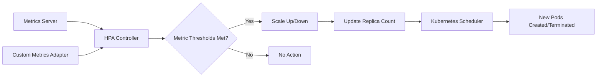

# Kubernetes Autoscaling Guide for Sattva Streamer

This comprehensive guide covers Horizontal Pod Autoscaling (HPA) configuration, tuning, and monitoring for Sattva Telegram Streamer on Kubernetes.

## Table of Contents

- [HPA Overview](#hpa-overview)
- [Metrics Used for Scaling](#metrics-used-for-scaling)
- [Configuring HPA for Each Service](#configuring-hpa-for-each-service)
- [Custom Metrics Setup](#custom-metrics-setup)
- [Testing Autoscaling](#testing-autoscaling)
- [Tuning Recommendations](#tuning-recommendations)
- [Cost Optimization Strategies](#cost-optimization-strategies)
- [Monitoring Autoscaling](#monitoring-autoscaling)

---

## HPA Overview

### What is Horizontal Pod Autoscaling?

Horizontal Pod Autoscaling (HPA) automatically scales the number of pods in a Deployment, StatefulSet, or ReplicaSet based on observed metrics. HPA is implemented as a Kubernetes API resource and controller.

### How HPA Works



**The HPA control loop:**

1. **Metrics Collection**: HPA collects metrics from Metrics Server and/or custom metrics adapters
2. **Evaluation**: HPA evaluates current metrics against target thresholds
3. **Calculation**: HPA calculates the desired replica count based on the ratio of current metric to target
4. **Scaling**: HPA scales the deployment up or down
5. **Stabilization**: HPA waits for the stabilization window before taking further action

### Key Concepts

| Concept | Description |
|---------|-------------|
| **Target** | The desired metric value (e.g., 70% CPU) |
| **MinReplicas** | Minimum number of pods (floor) |
| **MaxReplicas** | Maximum number of pods (ceiling) |
| **CurrentReplicas** | Current number of running pods |
| **DesiredReplicas** | Calculated target replica count |
| **StabilizationWindow** | Time to wait before scaling down |

### HPA Requirements

**Prerequisites:**

1. **Metrics Server installed:**
```bash
kubectl get deployment metrics-server --namespace kube-system
```

2. **Resource requests configured:**
```yaml
resources:
  requests:
    cpu: 250m
    memory: 256Mi
```

3. **Sufficient cluster capacity:**
```bash
kubectl describe nodes
```

---

## Metrics Used for Scaling

### Standard Resource Metrics

Standard metrics are built into Kubernetes and available through Metrics Server:

#### CPU Utilization

```yaml
metrics:
  - type: Resource
    resource:
      name: cpu
      target:
        type: Utilization
        averageUtilization: 70
```

**How it works:**
- Calculates percentage of requested CPU (not limit)
- Example: If request is 250m and pod uses 175m, utilization is 70%

#### Memory Utilization

```yaml
metrics:
  - type: Resource
    resource:
      name: memory
      target:
        type: Utilization
        averageUtilization: 80
```

**How it works:**
- Calculates percentage of requested memory (not limit)
- Example: If request is 256Mi and pod uses 205Mi, utilization is 80%

### Custom Metrics

Custom metrics are provided by Prometheus Adapter and allow scaling based on application-specific metrics:

#### Active Streams Metric

```yaml
metrics:
  - type: External
    external:
      metric:
        name: active_streams
        target:
          type: AverageValue
          value: "5"
```

**How it works:**
- Scales based on average number of active streams per pod
- Example: If target is 5 streams per pod and there are 50 active streams, HPA creates 10 pods

#### Request Rate Metric

```yaml
metrics:
  - type: External
    external:
      metric:
        name: http_requests_per_second
        target:
          type: AverageValue
          value: "100"
```

#### Queue Depth Metric

```yaml
metrics:
  - type: External
    external:
      metric:
        name: queue_depth
        target:
          type: AverageValue
          value: "50"
```

### Metric Comparison

| Metric Type | Provider | Use Case | Latency |
|-------------|----------|----------|---------|
| **CPU** | Metrics Server | General load | 15-30 seconds |
| **Memory** | Metrics Server | Memory pressure | 15-30 seconds |
| **Custom** | Prometheus Adapter | Application-specific | 30-60 seconds |

---

## Configuring HPA for Each Service

### Backend Service HPA

**Configuration in values.yaml:**

```yaml
backend:
  autoscaling:
    enabled: true
    minReplicas: 2
    maxReplicas: 10
    targetCPUUtilizationPercentage: 70
    targetMemoryUtilizationPercentage: 80
    customMetrics: []
```

**Generated HPA resource:**

```yaml
apiVersion: autoscaling/v2
kind: HorizontalPodAutoscaler
metadata:
  name: sattva-prod-backend
  namespace: sattva-prod
spec:
  scaleTargetRef:
    apiVersion: apps/v1
    kind: Deployment
    name: sattva-prod-backend
  minReplicas: 2
  maxReplicas: 10
  metrics:
    - type: Resource
      resource:
        name: cpu
        target:
          type: Utilization
          averageUtilization: 70
    - type: Resource
      resource:
        name: memory
        target:
          type: Utilization
          averageUtilization: 80
  behavior:
    scaleDown:
      stabilizationWindowSeconds: 300
      policies:
        - type: Percent
          value: 50
          periodSeconds: 60
    scaleUp:
      stabilizationWindowSeconds: 0
      policies:
        - type: Percent
          value: 100
          periodSeconds: 15
        - type: Pods
          value: 2
          periodSeconds: 15
      selectPolicy: Max
```

**Scaling Calculation Example:**

```
Current CPU: 85%
Target CPU: 70%
Current Replicas: 4

Desired Replicas = ceil(4 * (85 / 70)) = ceil(4.86) = 5
```

### Frontend Service HPA

**Configuration in values.yaml:**

```yaml
frontend:
  autoscaling:
    enabled: true
    minReplicas: 2
    maxReplicas: 6
    targetCPUUtilizationPercentage: 70
    targetMemoryUtilizationPercentage: 80
```

**Generated HPA resource:**

```yaml
apiVersion: autoscaling/v2
kind: HorizontalPodAutoscaler
metadata:
  name: sattva-prod-frontend
  namespace: sattva-prod
spec:
  scaleTargetRef:
    apiVersion: apps/v1
    kind: Deployment
    name: sattva-prod-frontend
  minReplicas: 2
  maxReplicas: 6
  metrics:
    - type: Resource
      resource:
        name: cpu
        target:
          type: Utilization
          averageUtilization: 70
    - type: Resource
      resource:
        name: memory
        target:
          type: Utilization
          averageUtilization: 80
  behavior:
    scaleDown:
      stabilizationWindowSeconds: 180
      policies:
        - type: Percent
          value: 50
          periodSeconds: 60
    scaleUp:
      stabilizationWindowSeconds: 0
      policies:
        - type: Percent
          value: 100
          periodSeconds: 15
        - type: Pods
          value: 2
          periodSeconds: 15
      selectPolicy: Max
```

### Rust Transcoder Service HPA

**Configuration in values.yaml:**

```yaml
rustTranscoder:
  autoscaling:
    enabled: true
    minReplicas: 2
    maxReplicas: 8
    targetCPUUtilizationPercentage: 75
    targetMemoryUtilizationPercentage: 80
```

**Generated HPA resource:**

```yaml
apiVersion: autoscaling/v2
kind: HorizontalPodAutoscaler
metadata:
  name: sattva-prod-rust-transcoder
  namespace: sattva-prod
spec:
  scaleTargetRef:
    apiVersion: apps/v1
    kind: Deployment
    name: sattva-prod-rust-transcoder
  minReplicas: 2
  maxReplicas: 8
  metrics:
    - type: Resource
      resource:
        name: cpu
        target:
          type: Utilization
          averageUtilization: 75
    - type: Resource
      resource:
        name: memory
        target:
          type: Utilization
          averageUtilization: 80
  behavior:
    scaleDown:
      stabilizationWindowSeconds: 300
      policies:
        - type: Percent
          value: 50
          periodSeconds: 60
    scaleUp:
      stabilizationWindowSeconds: 0
      policies:
        - type: Percent
          value: 100
          periodSeconds: 15
        - type: Pods
          value: 2
          periodSeconds: 15
      selectPolicy: Max
```

### Streamer Service (No HPA)

**Configuration in values.yaml:**

```yaml
streamer:
  autoscaling:
    enabled: false
```

**Why no HPA for Streamer?**

- **StatefulSet**: Streamer uses StatefulSet for persistent identity
- **Session persistence**: Each streamer instance maintains Telegram session state
- **Scaling strategy**: Manual scaling based on chat/channel allocation
- **Alternative**: Use multiple StatefulSets with different configurations

### HPA Comparison Table

| Service | Min Replicas | Max Replicas | CPU Target | Memory Target | Scale-Up Rate | Scale-Down Rate |
|---------|--------------|--------------|------------|---------------|---------------|-----------------|
| **Backend** | 2 | 10 | 70% | 80% | Fast (15s) | Slow (300s) |
| **Frontend** | 2 | 6 | 70% | 80% | Fast (15s) | Medium (180s) |
| **Transcoder** | 2 | 8 | 75% | 80% | Fast (15s) | Slow (300s) |
| **Streamer** | N/A | N/A | N/A | N/A | Manual | Manual |

---

## Custom Metrics Setup

### Prometheus Adapter Installation

Custom metrics require Prometheus Adapter to expose Prometheus metrics to the HPA controller.

**Step 1: Install Prometheus Operator (if not installed):**

```bash
# Add Helm repo
helm repo add prometheus-community https://prometheus-community.github.io/helm-charts
helm repo update

# Install Prometheus Operator
helm install prometheus prometheus-community/kube-prometheus-stack \
  --namespace monitoring \
  --create-namespace \
  --set prometheus.prometheusSpec.serviceMonitorSelectorNilUsesHelmValues=false
```

**Step 2: Install Prometheus Adapter:**

```bash
# Add Helm repo
helm repo add prometheus-community https://prometheus-community.github.io/helm-charts
helm repo update

# Install Prometheus Adapter
helm install prometheus-adapter prometheus-community/prometheus-adapter \
  --namespace monitoring \
  --values - << EOF
rules:
  default: true
  custom:
    - seriesQuery: '{__name__=~"^active_streams_.*"}'
      resources:
        overrides:
          namespace: {resource: "namespace"}
          pod: {resource: "pod"}
      name:
        matches: "^(.*)_total"
        as: "active_streams"
      metricsQuery: "sum(<<.Series>>{<<.LabelMatchers>>}) by (<<.GroupBy>>)"
EOF
```

**Step 3: Verify adapter is working:**

```bash
# Check adapter pod
kubectl get pods -n monitoring -l app.kubernetes.io/name=prometheus-adapter

# Check available custom metrics
kubectl get --raw /apis/custom.metrics.k8s.io/v1beta1 | jq .
```

### Defining Custom Metrics

**Example: Active Streams Metric**

Create a ServiceMonitor to expose the metric:

```yaml
apiVersion: monitoring.coreos.com/v1
kind: ServiceMonitor
metadata:
  name: sattva-backend-metrics
  namespace: sattva-prod
  labels:
    app: backend
spec:
  selector:
    matchLabels:
      app: backend
  endpoints:
    - port: http
      path: /metrics
      interval: 15s
```

**Add custom metric to HPA:**

```yaml
backend:
  autoscaling:
    customMetrics:
      - type: External
        external:
          metric:
            name: active_streams
          target:
            type: AverageValue
            value: "5"
```

### Custom Metrics Examples

#### 1. Request Rate per Pod

```yaml
metrics:
  - type: External
    external:
      metric:
        name: http_requests_per_second
      target:
        type: AverageValue
        value: "100"
```

#### 2. Queue Depth

```yaml
metrics:
  - type: External
    external:
      metric:
        name: queue_depth
      target:
        type: AverageValue
        value: "50"
```

#### 3. Active Connections

```yaml
metrics:
  - type: External
    external:
      metric:
        name: active_connections
      target:
        type: AverageValue
        value: "500"
```

#### 4. Error Rate

```yaml
metrics:
  - type: External
    external:
      metric:
        name: http_errors_per_second
      target:
        type: AverageValue
        value: "10"
```

### Prometheus Adapter Configuration

**Full configuration example:**

```yaml
apiVersion: v1
kind: ConfigMap
metadata:
  name: prometheus-adapter-config
  namespace: monitoring
data:
  config.yaml: |
    rules:
      # Stream metrics
      - seriesQuery: 'telegram_active_streams_total'
        resources:
          overrides:
            namespace: {resource: "namespace"}
            pod: {resource: "pod"}
        name:
          matches: "^(.*)_total"
          as: "active_streams"
        metricsQuery: "sum(<<.Series>>{<<.LabelMatchers>>}) by (<<.GroupBy>>)"

      # Request metrics
      - seriesQuery: 'http_requests_total'
        resources:
          overrides:
            namespace: {resource: "namespace"}
            pod: {resource: "pod"}
        name:
          matches: "^(.*)_total"
          as: "http_requests_per_second"
        metricsQuery: "rate(<<.Series>>{<<.LabelMatchers>>}[1m]) by (<<.GroupBy>>)"

      # Queue metrics
      - seriesQuery: 'sidekiq_queue_depth'
        resources:
          overrides:
            namespace: {resource: "namespace"}
            pod: {resource: "pod"}
        name:
          matches: "^(.*)"
          as: "queue_depth"
        metricsQuery: "<<.Series>>{<<.LabelMatchers>>}"
```

---

## Testing Autoscaling

### Load Testing with Locust

**Install Locust:**

```bash
pip install locust
```

**Create load test file (locustfile.py):**

```python
from locust import HttpUser, task, between

class SattvaBackendUser(HttpUser):
    wait_time = between(1, 3)

    def on_start(self):
        # Login
        response = self.client.post("/api/auth/login", json={
            "username": "test_user",
            "password": "test_password"
        })
        if response.status_code == 200:
            self.token = response.json()["token"]

    @task(3)
    def get_stream(self):
        self.client.get("/api/stream")

    @task(2)
    def get_queue(self):
        headers = {"Authorization": f"Bearer {self.token}"}
        self.client.get("/api/queue", headers=headers)

    @task(1)
    def get_health(self):
        self.client.get("/api/health")
```

**Run load test:**

```bash
# Port forward to backend
kubectl port-forward svc/sattva-prod-backend 8000:8000 --namespace=sattva-prod

# Run Locust
locust --host=http://localhost:8000 --users 100 --spawn-rate 10 --run-time 5m
```

**Monitor HPA during test:**

```bash
# Watch HPA status
watch kubectl get hpa --namespace=sattva-prod

# Get detailed HPA info
kubectl describe hpa sattva-prod-backend --namespace=sattva-prod

# Watch pod creation
watch kubectl get pods --namespace=sattva-prod -l app=backend
```

### Load Testing with k6

**Install k6:**

```bash
# macOS
brew install k6

# Linux
sudo apt-get install k6

# Or download from https://k6.io/
```

**Create load test file (load-test.js):**

```javascript
import http from 'k6/http';
import { check, sleep } from 'k6';

export const options = {
  stages: [
    { duration: '2m', target: 50 },   // Ramp up to 50 users
    { duration: '5m', target: 50 },   // Stay at 50 users
    { duration: '2m', target: 100 },  // Ramp up to 100 users
    { duration: '5m', target: 100 },  // Stay at 100 users
    { duration: '2m', target: 0 },    // Ramp down to 0
  ],
};

const BASE_URL = 'http://localhost:8000';

export default function () {
  // Health check
  let res = http.get(`${BASE_URL}/api/health`);
  check(res, { 'status was 200': (r) => r.status == 200 });

  sleep(1);
}
```

**Run load test:**

```bash
# Port forward to backend
kubectl port-forward svc/sattva-prod-backend 8000:8000 --namespace=sattva-prod

# Run k6
k6 run load-test.js
```

### Monitoring HPA Behavior

**Watch HPA in real-time:**

```bash
# Get HPA status every 2 seconds
watch -n 2 "kubectl get hpa --namespace=sattva-prod"
```

**Detailed HPA information:**

```bash
# Describe HPA for detailed metrics
kubectl describe hpa sattva-prod-backend --namespace=sattva-prod
```

**Output example:**

```
Name:                                                  sattva-prod-backend
Namespace:                                             sattva-prod
Labels:                                                app.kubernetes.io/name=backend
                                                       app.kubernetes.io/instance=sattva-prod
Annotations:                                           <none>
Metrics:                                               ( current / target )
  resource cpu on pods  (percentage of request):       82% (820m) / 70%
  resource memory on pods  (percentage of request):    65% (166Mi) / 80%
Min replicas:                                          2
Max replicas:                                          10
Deployment pods:                                       5 current / 5 desired
Conditions:
  Type         Status  Reason               Message
  ----         ------  ----                -------
  AbleToScale  True    ScaleReady           True because replica count increased
  ScalingActive  True   ValidMetricFound    the HPA was able to successfully calculate a replica count
Events:
  Type     Reason                        Age   From                       Message
  ----     ------                        ----  ----                       -------
  Normal   SuccessfulRescale             2m    horizontal-pod-autoscaler  New size: 4
  Normal   SuccessfulRescale             1m    horizontal-pod-autoscaler  New size: 5
```

### Verifying Scale-Up

**Test scale-up behavior:**

```bash
# 1. Get initial state
kubectl get hpa sattva-prod-backend --namespace=sattva-prod
kubectl get pods --namespace=sattva-prod -l app=backend

# 2. Apply load (in another terminal)
./load-test.sh

# 3. Watch scale-up
watch kubectl get pods --namespace=sattva-prod -l app=backend

# 4. Verify new pods are ready
kubectl wait --for=condition=ready pod -l app=backend --namespace=sattva-prod --timeout=300s

# 5. Check pod distribution
kubectl get pods --namespace=sattva-prod -l app=backend -o wide
```

**Expected scale-up timeline:**

| Time | Event |
|------|-------|
| 0:00 | Load test starts, 2 replicas |
| 0:30 | CPU exceeds 70%, HPA calculates need for 3 replicas |
| 1:00 | 3rd pod created and starting |
| 1:30 | 3rd pod ready, serving traffic |
| 2:00 | Load increases, CPU exceeds 70% again |
| 2:30 | HPA scales to 4 replicas |
| 3:00 | 4th pod created and ready |

### Verifying Scale-Down

**Test scale-down behavior:**

```bash
# 1. Stop load test
# Press Ctrl+C in load test terminal

# 2. Watch scale-down
watch kubectl get pods --namespace=sattva-prod -l app=backend

# 3. Wait for stabilization window (5 minutes)
# Pods will scale down after 5 minutes of low CPU
```

**Expected scale-down timeline:**

| Time | Event |
|------|-------|
| 0:00 | Load test stops, CPU drops below 70% |
| 0:30 | HPA detects lower CPU usage |
| 5:00 | Stabilization window expires |
| 5:30 | HPA scales down to 3 replicas |
| 6:00 | Pod terminated gracefully |

---

## Tuning Recommendations

### Setting Appropriate Thresholds

**CPU Threshold Guidelines:**

| Service Type | Recommended CPU Target | Rationale |
|--------------|------------------------|-----------|
| **CPU-bound** | 70-75% | Leave headroom for spikes |
| **I/O-bound** | 80-85% | Less sensitive to CPU |
| **Latency-sensitive** | 60-65% | Maintain low latency |
| **Batch processing** | 85-90% | Maximize throughput |

**Memory Threshold Guidelines:**

| Service Type | Recommended Memory Target | Rationale |
|--------------|---------------------------|-----------|
| **Java applications** | 70-75% | Avoid GC pressure |
| **Python applications** | 80-85% | Efficient memory use |
| **Node.js applications** | 85-90% | Lower memory footprint |
| **Databases** | 70-75% | Buffer cache needs |

### Resource Requests vs Limits

**Best Practices:**

1. **Set requests based on typical usage:**
```yaml
resources:
  requests:
    cpu: 250m      # 25% of a CPU core
    memory: 256Mi  # 256 MB of RAM
```

2. **Set limits to prevent noisy neighbors:**
```yaml
resources:
  limits:
    cpu: 1000m     # Maximum 1 CPU core
    memory: 512Mi  # Maximum 512 MB
```

3. **Ratio guidelines:**
   - CPU: `request:limit` = 1:2 to 1:4
   - Memory: `request:limit` = 1:1.5 to 1:2

**Example configurations:**

```yaml
# Conservative (stable but expensive)
resources:
  requests:
    cpu: 500m
    memory: 512Mi
  limits:
    cpu: 1000m
    memory: 1Gi

# Balanced (recommended)
resources:
  requests:
    cpu: 250m
    memory: 256Mi
  limits:
    cpu: 1000m
    memory: 512Mi

# Aggressive (cost-optimized)
resources:
  requests:
    cpu: 100m
    memory: 128Mi
  limits:
    cpu: 500m
    memory: 256Mi
```

### Stabilization Window Settings

**Scale-down stabilization window:**

Prevents thrashing when load fluctuates.

```yaml
behavior:
  scaleDown:
    stabilizationWindowSeconds: 300  # 5 minutes
```

**Recommended values:**

| Scenario | Stabilization Window |
|----------|---------------------|
| **Predictable traffic** | 180-300 seconds |
| **Bursty traffic** | 300-600 seconds |
| **Highly variable** | 600-900 seconds |

**Scale-up stabilization window:**

```yaml
behavior:
  scaleUp:
    stabilizationWindowSeconds: 0  # Immediate scale-up
```

**Recommendation:** Keep at 0 for responsive scaling.

### Scaling Rate Policies

**Scale-up policies:**

```yaml
behavior:
  scaleUp:
    policies:
      - type: Percent
        value: 100  # Double the replicas
        periodSeconds: 15
      - type: Pods
        value: 2    # Add 2 pods
        periodSeconds: 15
    selectPolicy: Max  # Use the policy that creates more pods
```

**Recommended scale-up rates:**

| Service Type | Scale-Up Rate | Rationale |
|--------------|---------------|-----------|
| **Web services** | 100% or 2 pods | Fast response to traffic spikes |
| **API services** | 50% or 2 pods | Moderate growth |
| **Worker services** | 50% or 1 pod | Controlled scaling |

**Scale-down policies:**

```yaml
behavior:
  scaleDown:
    policies:
      - type: Percent
        value: 50  # Reduce by half
        periodSeconds: 60
      - type: Pods
        value: 1    # Remove 1 pod
        periodSeconds: 60
    selectPolicy: Min  # Use the policy that removes fewer pods
```

### Environment-Specific Tuning

**Development:**
```yaml
autoscaling:
  enabled: false  # Manual control
  minReplicas: 1
  maxReplicas: 2
```

**Staging:**
```yaml
autoscaling:
  enabled: true
  minReplicas: 2
  maxReplicas: 5
  targetCPUUtilizationPercentage: 75  # Higher threshold
```

**Production:**
```yaml
autoscaling:
  enabled: true
  minReplicas: 3
  maxReplicas: 10
  targetCPUUtilizationPercentage: 70  # Lower threshold for responsiveness
```

---

## Cost Optimization Strategies

### Right-Sizing Resources

**Step 1: Gather baseline metrics:**

```bash
# Monitor resource usage over 7 days
kubectl top pods --namespace=sattva-prod -l app=backend --containers=true

# Export to CSV for analysis
kubectl top pods --namespace=sattva-prod -l app=backend --containers=true > usage-metrics.txt
```

**Step 2: Analyze patterns:**

```python
# Python script to analyze usage patterns
import pandas as pd

# Load metrics
data = pd.read_csv('usage-metrics.txt')

# Calculate percentiles
cpu_p95 = data['cpu'].quantile(0.95)
mem_p95 = data['memory'].quantile(0.95)

print(f"Recommended CPU request: {cpu_p95 * 0.8:.0f}m")
print(f"Recommended Memory request: {mem_p95 * 0.8:.0f}Mi")
```

**Step 3: Update values.yaml:**

```yaml
backend:
  resources:
    requests:
      cpu: 200m  # Reduced from 250m
      memory: 200Mi  # Reduced from 256Mi
    limits:
      cpu: 800m  # Reduced from 1000m
      memory: 400Mi  # Reduced from 512Mi
```

### Cluster Autoscaling Integration

**Enable Cluster Autoscaler:**

```bash
# Install Cluster Autoscaler (AWS example)
kubectl apply -f https://raw.githubusercontent.com/kubernetes/autoscaler/master/cluster-autoscaler/cloudprovider/aws/examples/cluster-autoscaler-autodiscover.yaml
```

**Configure cluster autoscaler:**

```yaml
apiVersion: v1
kind: ConfigMap
metadata:
  name: cluster-autoscaler
  namespace: kube-system
data:
  balance-similar-node-groups: "true"
  expander: "least-waste"
  max-node-provision-time: "15m"
  max-nodes-total: "20"
  max-nodes: "10"
  min-nodes: "3"
  scale-down-enabled: "true"
  scale-down-unneeded-time: "10m"
  scale-down-utilization-threshold: "0.5"
  skip-nodes-with-system-pods: "true"
```

### Using Spot/Preemptible Instances

**Configure node selector for spot instances:**

```yaml
backend:
  nodeSelector:
    node.kubernetes.io/instance-type: "spot"
  tolerations:
    - key: "spot"
      operator: "Equal"
      value: "true"
      effect: "NoSchedule"
```

**Considerations:**
- Lower cost (up to 90% savings)
- Can be preempted at any time
- Not suitable for stateful workloads
- Use for stateless services only

### Scheduled Scaling

**Reduce replicas during off-hours:**

```yaml
apiVersion: autoscaling/v2
kind: HorizontalPodAutoscaler
metadata:
  name: sattva-prod-backend-scheduled
spec:
  scaleTargetRef:
    apiVersion: apps/v1
    kind: Deployment
    name: sattva-prod-backend
  minReplicas: 2  # Night/weekend minimum
  maxReplicas: 10
  # Use Kubernetes CronJob to adjust minReplicas
```

**Create scheduled scaler:**

```yaml
apiVersion: batch/v1
kind: CronJob
metadata:
  name: sattva-prod-scale-up
spec:
  schedule: "0 8 * * 1-5"  # 8 AM on weekdays
  jobTemplate:
    spec:
      template:
        spec:
          containers:
          - name: kubectl
            image: bitnami/kubectl
            command:
            - /bin/sh
            - -c
            - kubectl patch hpa sattva-prod-backend -n sattva-prod -p '{"spec":{"minReplicas":5}}'
```

### Cost Monitoring

**Track costs per service:**

```bash
# Install kube-cost (if available)
helm install kubecost prometheus-community/kubecost \
  --namespace kubecost \
  --create-namespace

# Access dashboard
kubectl port-forward svc/kubecost-cost-analyzer 9090:9090 -n kubecost
```

**Calculate cost savings:**

```bash
# Before optimization
TOTAL_COST_BEFORE=$(kubectl top nodes | awk '{sum+=$2} END {print sum}')

# After optimization
TOTAL_COST_AFTER=$(kubectl top nodes | awk '{sum+=$2} END {print sum}')

# Calculate savings
SAVINGS=$(echo "($TOTAL_COST_BEFORE - $TOTAL_COST_AFTER) / $TOTAL_COST_BEFORE * 100" | bc -l)
echo "Cost savings: $SAVINGS%"
```

---

## Monitoring Autoscaling

### Grafana Dashboards

**Install Grafana:**

```bash
helm install grafana prometheus-community/kube-prometheus-stack \
  --namespace monitoring \
  --set grafana.enabled=true
```

**Import HPA Dashboard:**

1. Access Grafana: `kubectl port-forward svc/grafana 3000:80 -n monitoring`
2. Login (default: admin/admin)
3. Navigate to Dashboards → Import
4. Import dashboard ID: 12207 (Kubernetes / Compute Resources / HPA)

**Key metrics to monitor:**

| Metric | Description | Alert Threshold |
|--------|-------------|-----------------|
| **hpa_spec_max_replicas** | Maximum replicas configured | N/A |
| **hpa_status_desired_replicas** | Desired replica count | N/A |
| **hpa_status_current_replicas** | Current replica count | N/A |
| **kube_deployment_status_replicas_available** | Available replicas | < minReplicas |
| **kube_deployment_status_replicas_unavailable** | Unavailable replicas | > 0 |
| **rate(hpa_status_condition[5m])** | HPA condition changes | > 1 |

### Prometheus Queries

**HPA replica count over time:**

```promql
kube_horizontalpodautoscaler_status_current_replicas{namespace="sattva-prod", horizontalpodautoscaler="sattva-prod-backend"}
```

**CPU utilization by pod:**

```promql
sum(rate(container_cpu_usage_seconds_total{namespace="sattva-prod", pod=~"sattva-prod-backend-.*"}[5m])) by (pod) / sum(kube_pod_container_resource_requests{namespace="sattva-prod", pod=~"sattva-prod-backend-.*", resource="cpu"}) by (pod) * 100
```

**Memory utilization by pod:**

```promql
sum(container_memory_working_set_bytes{namespace="sattva-prod", pod=~"sattva-prod-backend-.*"}) by (pod) / sum(kube_pod_container_resource_requests{namespace="sattva-prod", pod=~"sattva-prod-backend-.*", resource="memory"}) by (pod) * 100
```

**Scaling events:**

```promql
changes(kube_horizontalpodautoscaler_status_current_replicas{namespace="sattva-prod"}[1h])
```

### Alerting Rules

**Create alerting rules:**

```yaml
apiVersion: monitoring.coreos.com/v1
kind: PrometheusRule
metadata:
  name: sattva-hpa-alerts
  namespace: sattva-prod
spec:
  groups:
    - name: hpa.rules
      rules:
        - alert: HPAAtMaxReplicas
          expr: |
            kube_horizontalpodautoscaler_status_current_replicas{namespace="sattva-prod"}
            >= kube_horizontalpodautoscaler_spec_max_replicas{namespace="sattva-prod"}
          for: 15m
          labels:
            severity: warning
          annotations:
            summary: "HPA at max replicas for 15 minutes"
            description: "HPA {{ $labels.horizontalpodautoscaler }} has been at max replicas for more than 15 minutes."

        - alert: HPAAtMinReplicas
          expr: |
            kube_horizontalpodautoscaler_status_current_replicas{namespace="sattva-prod"}
            <= kube_horizontalpodautoscaler_spec_min_replicas{namespace="sattva-prod"}
          for: 4h
          labels:
            severity: info
          annotations:
            summary: "HPA at min replicas for 4 hours"
            description: "HPA {{ $labels.horizontalpodautoscaler }} has been at min replicas for more than 4 hours. Consider reducing min replicas."

        - alert: HPAReplicaCountChangingFrequently
          expr: |
            changes(kube_horizontalpodautoscaler_status_current_replicas{namespace="sattva-prod"}[30m]) > 6
          labels:
            severity: warning
          annotations:
            summary: "HPA replica count changing frequently"
            description: "HPA {{ $labels.horizontalpodautoscaler }} has changed replica count more than 6 times in 30 minutes."
```

### Logging and Debugging

**Enable HPA controller logging:**

```yaml
apiVersion: v1
kind: ConfigMap
metadata:
  name: horizontal-pod-autoscaler-config
  namespace: kube-system
data:
  loglevel: "4"  # Set to 4 for debug logs
```

**View HPA controller logs:**

```bash
kubectl logs -n kube-system -l app=horizontal-pod-autoscaler --tail=100 -f
```

**Enable metrics server logging:**

```bash
kubectl edit deployment metrics-server -n kube-system

# Add to container args:
# - --v=2
```

---

## Best Practices Summary

### DO's

1. **Do set appropriate resource requests** - This is critical for HPA to work correctly
2. **Do use multiple metrics** - Combine CPU, memory, and custom metrics for better scaling decisions
3. **Do configure stabilization windows** - Prevents thrashing during load fluctuations
4. **Do monitor HPA behavior** - Use Grafana dashboards and alerts
5. **Do test autoscaling** - Run load tests before production deployment
6. **Do use different settings per environment** - Development vs staging vs production

### DON'Ts

1. **Don't set limits too low** - This causes OOMKills and CPU throttling
2. **Don't ignore memory scaling** - Memory leaks can cause issues
3. **Don't scale stateful services** - Use manual scaling for StatefulSets
4. **Don't forget about cluster capacity** - HPA can't scale if cluster is full
5. **Don't set maxReplicas too high** - This can cause cost issues
6. **Don't disable HPA in production** - Manual scaling is not practical

---

## Additional Resources

### Useful Commands

```bash
# List all HPAs
kubectl get hpa --all-namespaces

# Describe HPA
kubectl describe hpa sattva-prod-backend --namespace=sattva-prod

# Get HPA YAML
kubectl get hpa sattva-prod-backend --namespace=sattva-prod -o yaml

# Watch HPA changes
kubectl get hpa --namespace=sattva-prod --watch

# Get metrics from custom metrics API
kubectl get --raw /apis/custom.metrics.k8s.io/v1beta1 | jq .

# Get metrics for specific pods
kubectl get --raw /apis/custom.metrics.k8s.io/v1beta1/namespaces/sattva-prod/pods/*/active_streams | jq .
```

### Documentation

- [Kubernetes HPA Documentation](https://kubernetes.io/docs/tasks/run-application/horizontal-pod-autoscale/)
- [Prometheus Adapter](https://github.com/kubernetes-sigs/prometheus-adapter)
- [Metrics Server](https://github.com/kubernetes-sigs/metrics-server)

---

**Last Updated:** 2025-01-23
**Document Version:** 1.0.0
