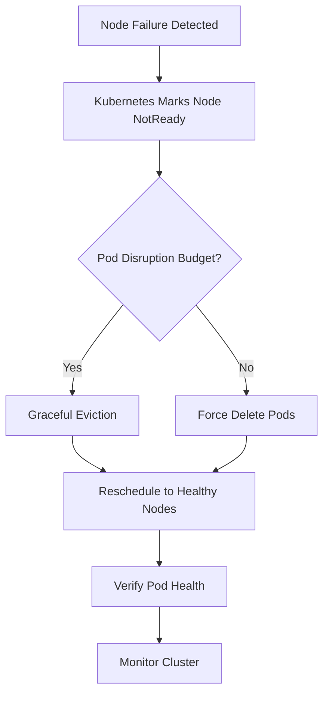
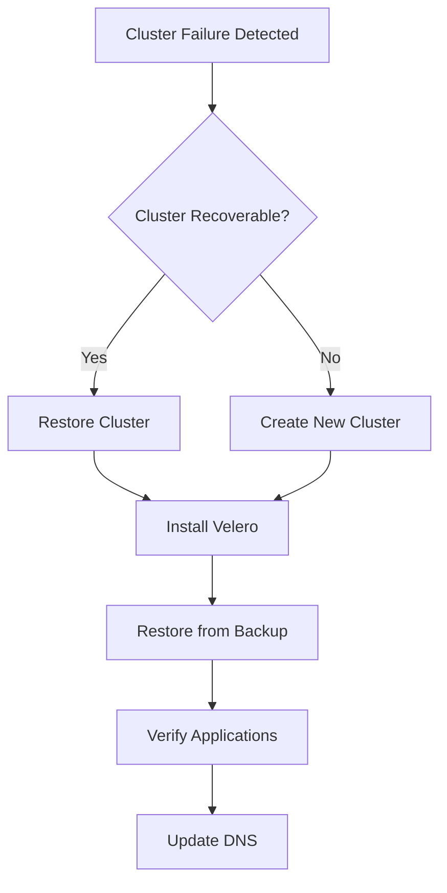
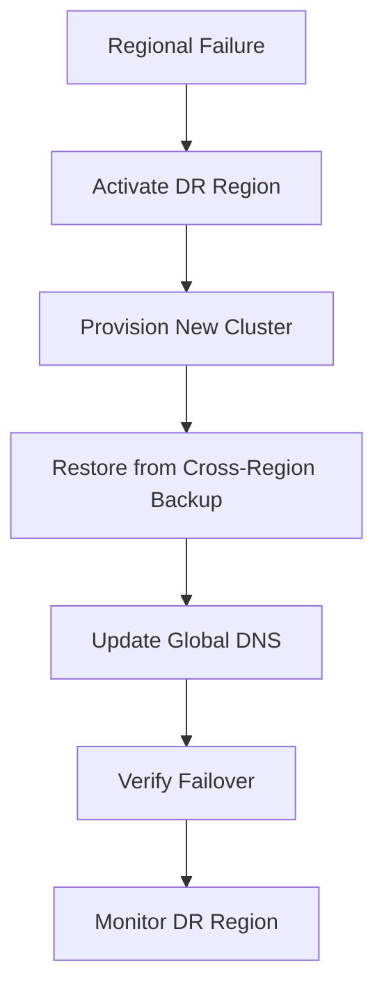
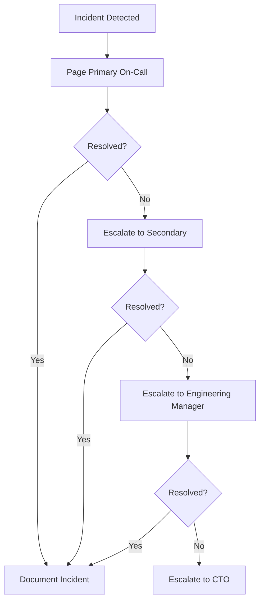

# Kubernetes Disaster Recovery Guide for Sattva Streamer

This comprehensive guide covers backup strategies, restore procedures, and disaster recovery planning for Sattva Telegram Streamer on Kubernetes.

## Table of Contents

- [Backup Strategy](#backup-strategy)
- [Restore Procedures](#restore-procedures)
- [Disaster Recovery Scenarios](#disaster-recovery-scenarios)
- [Testing Disaster Recovery](#testing-disaster-recovery)
- [RTO and RPO Targets](#rto-and-rpo-targets)
- [Emergency Contacts and Escalation](#emergency-contacts-and-escalation)

---

## Backup Strategy

### What to Backup

#### 1. PostgreSQL Database

**Data to backup:**
- User accounts and authentication data
- Stream metadata and configurations
- Queue and playlist data
- Application settings and preferences
- Analytics and monitoring data

**Backup tools:**
- `pg_dump` for logical backups
- `pg_basebackup` for physical backups
- Velero for Kubernetes-integrated backups
- Barman for continuous WAL archiving

#### 2. Redis Data

**Data to backup:**
- Session data
- Cache data
- Real-time stream status
- Queue metadata
- Rate limiting data

**Backup tools:**
- Redis RDB snapshots
- Redis AOF (Append-Only File)
- `redis-cli --rdb`
- Velero for PVC backups

#### 3. Streamer Sessions

**Data to backup:**
- Telegram session files (`.session` files)
- Session state and metadata
- Authentication credentials
- Streamer configuration files

**Backup tools:**
- Kubernetes PVC snapshots
- `kubectl cp` for manual extraction
- Velero for automated backups

#### 4. Persistent Volume Claims (PVCs)

**PVCs to backup:**
- PostgreSQL data PVC (10 GiB)
- Redis data PVC (5 GiB)
- Streamer session PVCs (1 GiB each)

**Backup tools:**
- Velero for PVC snapshots
- Cloud provider snapshot tools (EBS snapshots, etc.)
- Storage class snapshot features

#### 5. Kubernetes Resources

**Resources to backup:**
- Deployments, StatefulSets, Services
- ConfigMaps and Secrets
- Ingress rules
- RBAC configurations
- HPA configurations

**Backup tools:**
- `kubectl get` with YAML export
- Helm chart values and releases
- Velero for resource backups

### Backup Tools

#### Velero (Recommended)

**Install Velero:**

```bash
# Download Velero CLI
# macOS
brew install velero

# Linux
wget https://github.com/vmware-tanzu/velero/releases/download/v1.11.0/velero-v1.11.0-linux-amd64.tar.gz
tar -xvf velero-v1.11.0-linux-amd64.tar.gz
sudo mv velero-v1.11.0-linux-amd64/velero /usr/local/bin/

# Windows
# Download from https://github.com/vmware-tanzu/velero/releases

# Install Velero on Kubernetes (AWS example)
velero install \
  --provider aws \
  --plugins velero/velero-plugin-for-aws:v1.8.0 \
  --bucket sattva-velero-backups \
  --backup-location-config region=us-east-1 \
  --snapshot-location-config region=us-east-1 \
  --secret-file ./velero-credentials \
  --namespace velero
```

**Create Velero credentials file (`velero-credentials`):**

```ini
[default]
aws_access_key_id = YOUR_ACCESS_KEY
aws_secret_access_key = YOUR_SECRET_KEY
```

**Configure Velero:**

```bash
# Create backup schedule
velero schedule create daily-backup \
  --schedule="0 2 * * *" \
  --namespace sattva-prod \
  --include-namespaces sattva-prod \
  --include-resources deployments,statefulsets,services,pods,pvc,secrets,configmaps \
  --ttl 720h0m0s  # 30 days

# Create weekly full backup
velero schedule create weekly-full-backup \
  --schedule="0 2 * * 0" \
  --namespace sattva-prod \
  --include-namespaces sattva-prod \
  --include-resources '*' \
  --ttl 2160h0m0s  # 90 days

# Verify schedules
velero schedule get
```

#### pg_dump (PostgreSQL)

**Manual logical backup:**

```bash
# Backup from local machine
kubectl exec sattva-prod-postgresql-0 --namespace=sattva-prod -- pg_dump -U postgres telegram_db > backup-$(date +%Y%m%d-%H%M%S).sql

# Backup with compression
kubectl exec sattva-prod-postgresql-0 --namespace=sattva-prod -- pg_dump -U postgres telegram_db | gzip > backup-$(date +%Y%m%d-%H%M%S).sql.gz

# Backup specific tables
kubectl exec sattva-prod-postgresql-0 --namespace=sattva-prod -- pg_dump -U postgres -t users -t streams telegram_db > tables-backup.sql
```

**Automated backup script:**

```bash
#!/bin/bash
# scripts/k8s-backup-postgres.sh

BACKUP_DIR="/backups/postgres"
NAMESPACE="sattva-prod"
POD_NAME="sattva-prod-postgresql-0"
DB_NAME="telegram_db"
DB_USER="postgres"
TIMESTAMP=$(date +%Y%m%d-%H%M%S)
BACKUP_FILE="${BACKUP_DIR}/backup-${TIMESTAMP}.sql.gz"

# Create backup directory
mkdir -p ${BACKUP_DIR}

# Perform backup
kubectl exec ${POD_NAME} --namespace=${NAMESPACE} -- pg_dump -U ${DB_USER} ${DB_NAME} | gzip > ${BACKUP_FILE}

# Upload to S3 (optional)
# aws s3 cp ${BACKUP_FILE} s3://sattva-backups/postgres/

# Cleanup old backups (keep last 30 days)
find ${BACKUP_DIR} -name "backup-*.sql.gz" -mtime +30 -delete

echo "Backup completed: ${BACKUP_FILE}"
```

**CronJob for automated backups:**

```yaml
apiVersion: batch/v1
kind: CronJob
metadata:
  name: postgres-backup
  namespace: sattva-prod
spec:
  schedule: "0 2 * * *"  # 2 AM daily
  successfulJobsHistoryLimit: 7
  failedJobsHistoryLimit: 3
  jobTemplate:
    spec:
      template:
        spec:
          containers:
          - name: backup
            image: postgres:14
            command:
            - /bin/bash
            - -c
            - |
              pg_dump -U postgres -h sattva-prod-postgresql telegram_db | gzip > /backup/backup-$(date +%Y%m%d-%H%M%S).sql.gz
              aws s3 cp /backup/*.sql.gz s3://sattva-backups/postgres/ --region us-east-1
            env:
            - name: PGPASSWORD
              valueFrom:
                secretKeyRef:
                  name: sattva-prod-postgresql
                  key: postgres-password
            volumeMounts:
            - name: backup
              mountPath: /backup
          volumes:
          - name: backup
            persistentVolumeClaim:
              claimName: postgres-backup-pvc
          restartPolicy: OnFailure
```

#### Redis Backup

**Manual RDB snapshot:**

```bash
# Trigger snapshot
kubectl exec sattva-prod-redis-master-0 --namespace=sattva-prod -- redis-cli BGSAVE

# Wait for snapshot to complete
kubectl exec sattva-prod-redis-master-0 --namespace=sattva-prod -- redis-cli LASTSAVE

# Copy snapshot file
kubectl cp sattva-prod-redis-master-0:/data/dump.rdb ./redis-backup-$(date +%Y%m%d-%H%M%S).rdb --namespace=sattva-prod
```

**Automated backup script:**

```bash
#!/bin/bash
# scripts/k8s-backup-redis.sh

NAMESPACE="sattva-prod"
POD_NAME="sattva-prod-redis-master-0"
TIMESTAMP=$(date +%Y%m%d-%H%M%S)
BACKUP_FILE="./redis-backup-${TIMESTAMP}.rdb"

# Trigger background save
kubectl exec ${POD_NAME} --namespace=${NAMESPACE} -- redis-cli BGSAVE

# Wait for save to complete
sleep 10

# Copy backup file
kubectl cp ${NAMESPACE}/${POD_NAME}:/data/dump.rdb ${BACKUP_FILE}

# Upload to S3 (optional)
# aws s3 cp ${BACKUP_FILE} s3://sattva-backups/redis/

echo "Redis backup completed: ${BACKUP_FILE}"
```

#### Streamer Session Backup

**Manual session backup:**

```bash
# Copy session files from streamer pod
kubectl exec sattva-prod-streamer-0 --namespace=sattva-prod -- tar czf /tmp/sessions.tar.gz /app/data
kubectl cp sattva-prod-streamer-0:/tmp/sessions.tar.gz ./streamer-sessions-$(date +%Y%m%d-%H%M%S).tar.gz --namespace=sattva-prod
```

**Automated backup script:**

```bash
#!/bin/bash
# scripts/k8s-backup-streamer-sessions.sh

NAMESPACE="sattva-prod"
POD_NAME="sattva-prod-streamer-0"
TIMESTAMP=$(date +%Y%m%d-%H%M%S)
BACKUP_FILE="./streamer-sessions-${TIMESTAMP}.tar.gz"

# Create archive of session files
kubectl exec ${POD_NAME} --namespace=${NAMESPACE} -- tar czf /tmp/sessions.tar.gz /app/data

# Copy backup file
kubectl cp ${NAMESPACE}/${POD_NAME}:/tmp/sessions.tar.gz ${BACKUP_FILE}

# Upload to S3 (optional)
# aws s3 cp ${BACKUP_FILE} s3://sattva-backups/streamer-sessions/

echo "Streamer sessions backup completed: ${BACKUP_FILE}"
```

### Backup Schedule

#### Daily Automated Backups

| Time | Backup Type | Retention | Location |
|------|-------------|-----------|----------|
| 02:00 | PostgreSQL logical backup | 30 days | S3 + Velero |
| 02:30 | Redis RDB snapshot | 30 days | S3 + Velero |
| 03:00 | Streamer sessions | 30 days | S3 + Velero |
| 03:30 | PVC snapshots | 7 days | Velero |

#### Weekly Full Backups

| Day | Backup Type | Retention | Location |
|-----|-------------|-----------|----------|
| Sunday 02:00 | Full cluster backup | 90 days | S3 + Velero |

#### Backup Retention Policy

```yaml
# Velero backup retention
velero schedule create daily-backup \
  --ttl 720h0m0s  # 30 days

velero schedule create weekly-backup \
  --ttl 2160h0m0s  # 90 days

velero schedule create monthly-archive \
  --ttl 8760h0m0s  # 365 days
```

### Storing Backups Safely

#### Off-Site Storage

**AWS S3 Configuration:**

```bash
# Create S3 bucket
aws s3 mb s3://sattva-backups --region us-east-1

# Enable versioning
aws s3api put-bucket-versioning \
  --bucket sattva-backups \
  --versioning-configuration Status=Enabled

# Enable encryption
aws s3api put-bucket-encryption \
  --bucket sattva-backups \
  --server-side-encryption-configuration '{
    "Rules": [
      {
        "ApplyServerSideEncryptionByDefault": {
          "SSEAlgorithm": "AES256"
        }
      }
    ]
  }'

# Set lifecycle policy
aws s3api put-bucket-lifecycle-configuration \
  --bucket sattva-backups \
  --lifecycle-configuration file://lifecycle.json
```

**Lifecycle policy (`lifecycle.json`):**

```json
{
  "Rules": [
    {
      "Id": "DeleteOldBackups",
      "Status": "Enabled",
      "Prefix": "",
      "Expiration": {
        "Days": 90
      },
      "NoncurrentVersionExpiration": {
        "NoncurrentDays": 30
      }
    }
  ]
}
```

#### Backup Encryption

**Encrypt backups before upload:**

```bash
#!/bin/bash
# Encrypt backup using GPG

BACKUP_FILE="backup.sql.gz"
ENCRYPTED_FILE="${BACKUP_FILE}.gpg"
GPG_RECIPIENT="admin@sattva-streamer.top"

# Encrypt
gpg --encrypt --recipient ${GPG_RECIPIENT} ${BACKUP_FILE}

# Upload encrypted file
aws s3 cp ${ENCRYPTED_FILE} s3://sattva-backups/encrypted/

# Delete local files
shred -u ${BACKUP_FILE}
```

**Decrypt backup:**

```bash
# Download and decrypt
aws s3 cp s3://sattva-backups/encrypted/backup.sql.gz.gpg .
gpg --decrypt backup.sql.gz.gpg > backup.sql.gz
```

---

## Restore Procedures

### Restoring PostgreSQL from Backup

#### Method 1: Using pg_restore

```bash
# List available backups
ls -lh /backups/postgres/

# Stop backend services
kubectl scale deployment sattva-prod-backend --replicas=0 --namespace=sattva-prod

# Restore from backup
gunzip -c backup-20250123-020000.sql.gz | kubectl exec -i sattva-prod-postgresql-0 --namespace=sattva-prod -- psql -U postgres telegram_db

# Verify restore
kubectl exec sattva-prod-postgresql-0 --namespace=sattva-prod -- psql -U postgres telegram_db -c "\dt"

# Restart backend services
kubectl scale deployment sattva-prod-backend --replicas=3 --namespace=sattva-prod
```

#### Method 2: Using Velero

```bash
# List available backups
velero backup get --namespace sattva-prod

# Restore from specific backup
velero restore create \
  --namespace sattva-prod \
  --from-backup daily-backup-20250123020000 \
  --include-resources deployments,statefulsets,services,pods,pvc,secrets,configmaps

# Monitor restore progress
velero restore get --namespace sattva-prod
velero restore describe daily-backup-20250123020000-xxxxx --namespace sattva-prod

# Verify restore
kubectl get all --namespace=sattva-prod
kubectl get pvc --namespace=sattva-prod
```

#### Method 3: Point-in-Time Recovery (PITR)

**Set up continuous archiving:**

```yaml
# Enable WAL archiving in PostgreSQL
apiVersion: v1
kind: ConfigMap
metadata:
  name: postgresql-config
  namespace: sattva-prod
data:
  postgresql.conf: |
    wal_level = replica
    archive_mode = on
    archive_command = 'aws s3 cp %p s3://sattva-backups/postgres-wal/%f'
    max_wal_senders = 3
    wal_keep_size = 1GB
```

**Restore to specific point in time:**

```bash
# Download base backup and WAL files
aws s3 sync s3://sattva-backups/postgres/base/ /tmp/pg-base/
aws s3 sync s3://sattva-backups/postgres-wal/ /tmp/pg-wal/

# Restore base backup
kubectl exec sattva-prod-postgresql-0 --namespace=sattva-prod -- pg_restore -U postgres -d telegram_db /tmp/pg-base/base.tar.gz

# Replay WAL files up to target time
kubectl exec sattva-prod-postgresql-0 --namespace=sattva-prod -- psql -U postgres telegram_db -c "SELECT pg_wal_replay_resume();"
```

### Restoring Redis from Backup

#### Method 1: Using RDB File

```bash
# List available backups
ls -lh /backups/redis/

# Stop Redis
kubectl scale statefulset sattva-prod-redis --replicas=0 --namespace=sattva-prod

# Delete existing data
kubectl exec -it sattva-prod-redis-master-0 --namespace=sattva-prod -- rm -rf /data/dump.rdb

# Copy backup file
kubectl cp redis-backup-20250123-020000.rdb sattva-prod-redis-master-0:/data/dump.rdb --namespace=sattva-prod

# Restart Redis
kubectl scale statefulset sattva-prod-redis --replicas=1 --namespace=sattva-prod

# Verify restore
kubectl exec sattva-prod-redis-master-0 --namespace=sattva-prod -- redis-cli DBSIZE
```

#### Method 2: Using Velero

```bash
# Restore Redis PVC from backup
velero restore create \
  --namespace sattva-prod \
  --from-backup daily-backup-20250123020000 \
  --include-resources persistentvolumeclaims \
  --selector app=redis

# Restart Redis StatefulSet
kubectl rollout restart statefulset sattva-prod-redis --namespace=sattva-prod
```

### Restoring Streamer Session Data

```bash
# Stop streamer
kubectl scale statefulset sattva-prod-streamer --replicas=0 --namespace=sattva-prod

# Extract session files
kubectl cp streamer-sessions-20250123-020000.tar.gz sattva-prod-streamer-0:/tmp/ --namespace=sattva-prod

# Restore session files
kubectl exec sattva-prod-streamer-0 --namespace=sattva-prod -- tar xzf /tmp/streamer-sessions-20250123-020000.tar.gz -C /

# Restart streamer
kubectl scale statefulset sattva-prod-streamer --replicas=1 --namespace=sattva-prod

# Verify session files
kubectl exec sattva-prod-streamer-0 --namespace=sattva-prod -- ls -la /app/data/
```

### Restoring Kubernetes Resources

#### Restore Using Velero

```bash
# Full namespace restore
velero restore create \
  --namespace sattva-prod \
  --from-backup daily-backup-20250123020000

# Selective restore (only specific resources)
velero restore create \
  --namespace sattva-prod \
  --from-backup daily-backup-20250123020000 \
  --include-resources deployments,services

# Restore to different namespace
velero restore create \
  --namespace sattva-restore \
  --from-backup daily-backup-20250123020000 \
  --namespace-mappings sattva-prod:sattva-restore
```

#### Restore Using Helm

```bash
# List Helm releases
helm list --namespace sattva-prod

# Reinstall from release
helm install sattva-prod helm/sattva-streamer \
  --namespace sattva-prod \
  --values helm/sattva-streamer/values.yaml \
  --values helm/sattva-streamer/values-prod.yaml \
  --restore
```

### Verification Steps After Restore

#### Database Verification

```bash
# Connect to PostgreSQL
kubectl exec -it sattva-prod-postgresql-0 --namespace=sattva-prod -- psql -U postgres telegram_db

# Run verification queries
\dt
SELECT COUNT(*) FROM users;
SELECT COUNT(*) FROM streams;
SELECT * FROM settings;
```

#### Application Verification

```bash
# Check all pods are running
kubectl get pods --namespace=sattva-prod

# Check pod logs
kubectl logs -l app=backend --namespace=sattva-prod --tail=50

# Run health checks
./scripts/k8s-health-check.sh sattva

# Test application endpoints
curl https://api.sattva-streamer.top/api/health
curl https://sattva-streamer.top/
```

#### Data Integrity Verification

```bash
# Verify user data
curl https://api.sattva-streamer.top/api/users | jq .

# Verify stream data
curl https://api.sattva-streamer.top/api/streams | jq .

# Verify queue data
curl https://api.sattva-streamer.top/api/queue | jq .
```

---

## Disaster Recovery Scenarios

### Node Failure

**Scenario:** One or more worker nodes fail

**Impact:**
- Pods on failed nodes are terminated
- StatefulSets may lose quorum
- PVCs may become unavailable

**Recovery Process:**



**Automated Recovery:**

1. **Kubernetes automatically reschedules pods** to healthy nodes
2. **StatefulSet pods** are recreated with persistent volumes
3. **PDB (Pod Disruption Budget)** ensures minimum availability

**Manual intervention (if needed):**

```bash
# Check node status
kubectl get nodes
kubectl describe node <failed-node>

# Mark node as unschedulable
kubectl cordon <failed-node>

# Drain node (if safe)
kubectl drain <failed-node> --ignore-daemonsets --delete-emptydir-data

# Remove node from cluster (if permanently failed)
kubectl delete node <failed-node>

# Verify pods are rescheduled
kubectl get pods --namespace=sattva-prod -o wide
```

**Verification:**

```bash
# Check all pods are running
kubectl get pods --namespace=sattva-prod

# Check PVCs are attached
kubectl get pvc --namespace=sattva-prod

# Check StatefulSet is healthy
kubectl get statefulset --namespace=sattva-prod
```

### Cluster Failure

**Scenario:** Entire Kubernetes cluster becomes unavailable

**Impact:**
- Complete service outage
- No access to applications
- Data potentially at risk

**Recovery Process:**



**Step 1: Create New Cluster**

```bash
# Using cloud provider CLI
# AWS EKS example
aws eks create-cluster \
  --name sattva-prod-recovery \
  --role-arn arn:aws:iam::ACCOUNT_ID:role/EKSClusterRole \
  --resources-vpc-config subnetIds=SUBNET_IDS,securityGroupIds=SG_IDS \
  --region us-east-1

# Update kubeconfig
aws eks update-kubeconfig --name sattva-prod-recovery --region us-east-1
```

**Step 2: Install Velero**

```bash
# Install Velero in new cluster
velero install \
  --provider aws \
  --plugins velero/velero-plugin-for-aws:v1.8.0 \
  --bucket sattva-velero-backups \
  --backup-location-config region=us-east-1 \
  --namespace velero
```

**Step 3: Restore from Backup**

```bash
# List available backups
velero backup get

# Restore entire namespace
velero restore create \
  --namespace sattva-prod \
  --from-backup weekly-full-backup-20250119020000

# Monitor restore
velero restore get
velero restore describe <restore-name> --details
```

**Step 4: Update DNS**

```bash
# Update DNS records to point to new cluster
# Example: Update Route53 hosted zone
aws route53 change-resource-record-sets \
  --hosted-zone-id ZONE_ID \
  --change-batch file://dns-change.json
```

**Step 5: Verify Recovery**

```bash
# Check all resources
kubectl get all --namespace=sattva-prod

# Run health checks
./scripts/k8s-health-check.sh sattva

# Test application
curl https://api.sattva-streamer.top/api/health
```

### Data Corruption

**Scenario:** Database or cache data becomes corrupted

**Impact:**
- Application errors
- Data inconsistency
- Potential data loss

**Recovery Process:**

**Step 1: Identify Corruption**

```bash
# Check PostgreSQL for corruption
kubectl exec sattva-prod-postgresql-0 --namespace=sattva-prod -- psql -U postgres telegram_db -c "SELECT * FROM users WHERE id = 1;"

# Check Redis for corruption
kubectl exec sattva-prod-redis-master-0 --namespace=sattva-prod -- redis-cli --scan

# Check application logs
kubectl logs -l app=backend --namespace=sattva-prod | grep -i error
```

**Step 2: Stop Applications**

```bash
# Scale down all deployments
kubectl scale deployment sattva-prod-backend --replicas=0 --namespace=sattva-prod
kubectl scale deployment sattva-prod-frontend --replicas=0 --namespace=sattva-prod
kubectl scale deployment sattva-prod-rust-transcoder --replicas=0 --namespace=sattva-prod
```

**Step 3: Restore Data**

```bash
# Restore PostgreSQL from last known good backup
kubectl exec -i sattva-prod-postgresql-0 --namespace=sattva-prod -- psql -U postgres telegram_db < backup-20250122-020000.sql

# Restore Redis from last known good backup
kubectl cp redis-backup-20250122-020000.rdb sattva-prod-redis-master-0:/data/dump.rdb --namespace=sattva-prod

# Restart services
kubectl scale deployment sattva-prod-backend --replicas=3 --namespace=sattva-prod
```

**Step 4: Verify Data Integrity**

```bash
# Run data integrity checks
kubectl exec sattva-prod-postgresql-0 --namespace=sattva-prod -- psql -U postgres telegram_db -c "SELECT COUNT(*) FROM users;"

# Test application endpoints
curl https://api.sattva-streamer.top/api/health
```

### Regional Failure

**Scenario:** Entire AWS region becomes unavailable

**Impact:**
- Complete service outage
- Need to failover to another region

**Recovery Process:**



**Step 1: Activate DR Region**

```bash
# Set AWS region to DR region
export AWS_DEFAULT_REGION=us-west-2

# Create new EKS cluster in DR region
aws eks create-cluster \
  --name sattva-prod-dr \
  --region us-west-2 \
  ...
```

**Step 2: Restore from Cross-Region Backup**

```bash
# Copy backups from S3 in primary region to DR region
aws s3 sync s3://sattva-backups s3://sattva-backups-dr --source-region us-east-1 --region us-west-2

# Restore using Velero
velero restore create \
  --namespace sattva-prod \
  --from-backup weekly-full-backup-20250119020000
```

**Step 3: Update Global DNS**

```bash
# Update Route53 health checks
aws route53 update-health-check --health-check-id HC_ID --disabled

# Update failover routing policy
aws route53 change-resource-record-sets \
  --hosted-zone-id ZONE_ID \
  --change-batch file://failover-change.json
```

**Step 4: Verify Failover**

```bash
# Test application in DR region
curl https://api.sattva-streamer.top/api/health

# Monitor application metrics
kubectl top pods --namespace=sattva-prod
```

---

## Testing Disaster Recovery

### Regular Drill Schedule

**Monthly Drills:**
- Node failure simulation
- Individual service recovery
- Database restore verification

**Quarterly Drills:**
- Partial cluster failure
- Multi-region failover test
- Complete restore from backup

**Annual Drill:**
- Full disaster recovery scenario
- Regional failover
- End-to-end recovery verification

### Simulation Scenarios

#### Scenario 1: Node Failure

```bash
#!/bin/bash
# Simulate node failure by cordoning and draining

# Get a node to test
NODE=$(kubectl get nodes -o jsonpath='{.items[0].metadata.name}')

# Cordone node
kubectl cordon ${NODE}

# Simulate failure by stopping kubelet
kubectl debug node/${NODE} -it --image=ubuntu -- systemctl stop kubelet

# Verify pods are rescheduled
kubectl get pods -o wide

# Recover node
kubectl debug node/${NODE} -it --image=ubuntu -- systemctl start kubelet
kubectl uncordon ${NODE}
```

#### Scenario 2: Database Failure

```bash
#!/bin/bash
# Simulate database failure

# Stop PostgreSQL
kubectl scale statefulset sattva-prod-postgresql --replicas=0 --namespace=sattva-prod

# Verify impact
kubectl get pods --namespace=sattva-prod
kubectl logs -l app=backend --namespace=sattva-prod --tail=20

# Restore PostgreSQL
kubectl scale statefulset sattva-prod-postgresql --replicas=1 --namespace=sattva-prod

# Verify recovery
kubectl exec sattva-prod-postgresql-0 --namespace=sattva-prod -- psql -U postgres telegram_db -c "SELECT version();"
```

#### Scenario 3: Data Corruption

```bash
#!/bin/bash
# Simulate data corruption

# Connect to PostgreSQL
kubectl exec -it sattva-prod-postgresql-0 --namespace=sattva-prod -- psql -U postgres telegram_db

# Corrupt some data
UPDATE users SET email = 'corrupted' WHERE id = 1;
```

```bash
# Restore from backup
kubectl exec -i sattva-prod-postgresql-0 --namespace=sattva-prod -- psql -U postgres telegram_db < backup-20250122-020000.sql

# Verify restore
kubectl exec sattva-prod-postgresql-0 --namespace=sattva-prod -- psql -U postgres telegram_db -c "SELECT * FROM users WHERE id = 1;"
```

### Documentation of Lessons Learned

**After each drill, document:**

1. **What went well**
2. **What could be improved**
3. **Action items**
4. **Timeline of recovery**
5. **MTTR (Mean Time To Recovery) achieved**

**Template:**

```markdown
# Disaster Recovery Drill Report

**Date:** YYYY-MM-DD
**Scenario:** [Scenario Description]
**Participants:** [Names]

## Timeline
- 00:00 - Drill initiated
- 00:05 - Failure detected
- 00:10 - Recovery started
- 00:45 - Recovery completed

## What Went Well
- [List successes]

## Issues Encountered
- [List issues]

## Action Items
- [ ] [Action item 1]
- [ ] [Action item 2]

## MTTR Achieved
- Target: 30 minutes
- Actual: 45 minutes

## Recommendations
- [List recommendations]
```

---

## RTO and RPO Targets

### Recovery Time Objective (RTO)

**Definition:** Maximum acceptable time to restore service after a disaster

**Targets by Service:**

| Service | RTO Target | Justification |
|---------|------------|---------------|
| **Frontend** | 15 minutes | Static content, cached |
| **Backend API** | 30 minutes | Critical for application |
| **Streamer** | 1 hour | Manual session restoration |
| **Database** | 30 minutes | Automated backup restore |
| **Redis** | 15 minutes | Quick PVC restore |

### Recovery Point Objective (RPO)

**Definition:** Maximum acceptable data loss measured in time

**Targets by Service:**

| Service | RPO Target | Backup Frequency | Justification |
|---------|------------|------------------|---------------|
| **PostgreSQL** | 1 hour | Hourly WAL archiving | Acceptable data loss |
| **Redis** | 24 hours | Daily RDB snapshot | Cache data only |
| **Streamer Sessions** | 24 hours | Daily backup | Session state can be rebuilt |

### Achieving RTO/RPO Targets

**For PostgreSQL:**
- **RPO 1 hour:** Enable continuous WAL archiving to S3
- **RTO 30 minutes:** Pre-stage backup files, use fast restore method

**For Redis:**
- **RPO 24 hours:** Daily RDB snapshots
- **RTO 15 minutes:** Use Velero for fast PVC restore

**For Streamer:**
- **RPO 24 hours:** Daily session backups
- **RTO 1 hour:** Manual session restoration process

---

## Emergency Contacts and Escalation

### On-Call Rotation

**Primary On-Call:**
- **Name:** [Primary On-Call Engineer]
- **Phone:** +1-XXX-XXX-XXXX
- **Email:** oncall@sattva-streamer.top

**Secondary On-Call:**
- **Name:** [Secondary On-Call Engineer]
- **Phone:** +1-XXX-XXX-XXXX
- **Email:** oncall-backup@sattva-streamer.top

### Escalation Path



### Escalation Levels

**Level 1: On-Call Engineer (Immediate)**
- Respond within 15 minutes
- Attempt initial diagnosis and remediation

**Level 2: Secondary On-Call (15 minutes)**
- Escalate if primary unavailable
- Assist with complex issues

**Level 3: Engineering Manager (30 minutes)**
- Escalate for critical incidents
- Coordinate cross-team response

**Level 4: CTO (1 hour)**
- Escalate for catastrophic failures
- Make business-critical decisions

### Emergency Runbook

**Step 1: Assess Impact**
- What services are affected?
- How many users are impacted?
- Is data at risk?

**Step 2: Initial Response**
- Page on-call engineer
- Create incident ticket
- Update status page

**Step 3: Diagnosis**
- Check monitoring dashboards
- Review logs and metrics
- Identify root cause

**Step 4: Mitigation**
- Implement temporary fix
- Restore from backup if needed
- Communicate with stakeholders

**Step 5: Resolution**
- Verify service recovery
- Close incident ticket
- Document lessons learned

---

## Additional Resources

### Useful Commands

```bash
# Backup operations
velero backup get
velero backup describe <backup-name>
velero backup logs <backup-name>

# Restore operations
velero restore get
velero restore describe <restore-name>

# PostgreSQL operations
kubectl exec -it postgresql-0 -- psql -U postgres telegram_db
pg_dump -U postgres telegram_db > backup.sql
psql -U postgres telegram_db < backup.sql

# Redis operations
kubectl exec -it redis-master-0 -- redis-cli
redis-cli BGSAVE
redis-cli LASTSAVE

# Volume snapshots
kubectl get pv
kubectl get pvc
```

### Monitoring and Alerting

**Key metrics to monitor:**
- Backup job success/failure
- Backup age (time since last backup)
- Restore point achievement
- Disk space usage for backups
- Database replication lag

**Alert configuration:**

```yaml
# Prometheus alert for backup failures
groups:
  - name: backup.alerts
    rules:
      - alert: BackupJobFailed
        expr: |
          velero_backup_status{phase="Failed"} > 0
        for: 5m
        labels:
          severity: critical
        annotations:
          summary: "Velero backup job failed"
```

---

**Last Updated:** 2025-01-23
**Document Version:** 1.0.0
