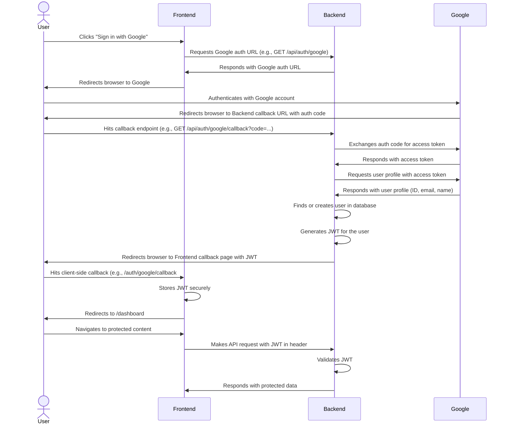

# Feature Specification: User Authentication with Google

**Feature Branch**: `002-google-auth`
**Created**: 17.11.2025
**Status**: Draft
**Input**: User description: "реализовать функцию аунтефикации через google"

## User Scenarios & Testing *(mandatory)*

### User Story 1 - Sign in with Google (Priority: P1)

As a user, I want to sign up or log in to the application using my Google account so that I can quickly and securely access the service without creating or managing a separate set of credentials.

**Why this priority**: This is the core functionality that enables users to join and access the platform, which is essential for user acquisition and retention.

**Independent Test**: A user can visit the login page, click "Sign in with Google", complete the Google authentication flow, and be redirected back to the application as a logged-in user, whether they are new or returning.

**Acceptance Scenarios**:

1.  **Given** a user is not logged in and does not have an account, **When** they click the "Sign in with Google" button and successfully authenticate with Google, **Then** a new user account is created in the system using their Google profile information and they are redirected to the application's main dashboard (`/dashboard`).
2.  **Given** a user has an existing account created via Google login, **When** they click "Sign in with Google" and successfully authenticate, **Then** the system identifies their existing account and logs them in, redirecting them to the main dashboard (`/dashboard`).
3.  **Given** a user is not logged in, **When** they click "Sign in with Google" but cancel the process on Google's site, **Then** they are redirected back to the application's login page (`/login`) and remain unauthenticated.

---

### User Story 2 - User Logout (Priority: P2)

As an authenticated user, I want to be able to log out of the application so that I can securely end my session.

**Why this priority**: Provides a basic security function that users expect.

**Independent Test**: A logged-in user can click a "Logout" button and have their session terminated.

**Acceptance Scenarios**:

1.  **Given** a user is logged in, **When** they click the "Logout" button, **Then** their session is terminated and they are redirected to the public home page or login screen (`/login`).

---

### Edge Case & Failure Scenario Requirements

-   **ECR-001**: If a user attempts to sign up with Google and their email already exists from a different authentication method, the system MUST block the sign-up and return an error state to the client. The frontend MUST display the "account with this email already exists" message.
-   **ECR-002**: If the backend fails to communicate with Google's authentication service (due to timeout, network error, or 5xx response), the backend MUST return a service unavailable error. The frontend MUST display the "Could not connect to Google" message.
-   **ECR-003**: For this version, the system WILL allow authentication for users with unverified Google account emails, but the backend SHOULD log a warning. Future versions may require email verification.
-   **ECR-004**: If the backend receives an invalid or expired JWT from the client, it MUST respond with a `401 Unauthorized` status. The frontend MUST handle this by clearing any stored session data and redirecting the user to the login page (`/login`).
-   **ECR-005**: If a user revokes the application's access from their Google account, their next API request with the now-invalid JWT will fail validation (per ECR-004), effectively logging them out.
-   **ECR-006**: If the backend successfully authenticates with Google but fails to write to the database, it MUST NOT generate a JWT and MUST return a `500 Internal Server Error`. A critical error MUST be logged. The frontend MUST display the generic "Authentication failed" message.

## Requirements *(mandatory)*

### Functional Requirements

-   **FR-001**: The system MUST provide a "Sign in with Google" button on the login/signup page.
-   **FR-002**: The system MUST use the OAuth 2.0 protocol to authenticate users against their Google account, requesting the `openid`, `email`, and `profile` scopes.
-   **FR-003**: Upon successful first-time authentication, the system MUST create a new user account and persist the user's Google ID, email, full name, and profile picture URL.
-   **FR-004**: Upon successful authentication for a returning user, the system MUST identify the existing user based on their unique Google ID and grant them access.
-   **FR-005**: The system MUST create and manage a user session after a successful login.
-   **FR-006**: The system MUST provide a mechanism for users to log out, which terminates their session.

### Session Management
-   **FR-007**: The system MUST manage user sessions via a secure, stateless JSON Web Token (JWT).
-   **FR-008**: The JWT MUST be stored securely on the client (e.g., in an HttpOnly cookie).
-   **FR-009**: The JWT MUST have a default expiration time of 24 hours.

### Non-Functional Requirements

-   **NFR-001**: The system SHOULD refresh the user's name and profile picture from their Google profile upon each successful login to keep data current.
-   **NFR-002**: All API endpoints related to authentication MUST include structured logging for monitoring and auditing purposes.

### User-Facing Messages

-   **On email conflict**: "An account with this email already exists. Please sign in with your original method."
-   **On generic auth failure**: "Authentication failed. Please try again or contact support if the problem persists."
-   **On Google service error**: "Could not connect to Google. Please try again later."

### Key Entities *(include if feature involves data)*

-   **User**: Represents a user in the system.
    | Attribute | Type | Description | Example |
    |---|---|---|---|
    | `id` | UUID | Primary key in the database. | `a1b2c3d4-e5f6-7890-1234-567890abcdef` |
    | `google_id` | String | The user's unique Google ID. | `109876543210987654321` |
    | `email` | String | The user's email address. | `user@example.com` |
    | `full_name` | String | The user's full name. | `John Doe` |
    | `profile_picture_url` | String | URL to the user's Google profile picture. | `https://lh3.googleusercontent.com/...` |
    | `created_at` | DateTime | Timestamp of user creation. | `2025-11-18T10:00:00Z` |
    | `updated_at` | DateTime | Timestamp of last user update. | `2025-11-18T10:00:00Z` |

### Application Routing

-   **/login**: The public-facing page containing the "Sign in with Google" button. This is the primary entry point for unauthenticated users.
-   **/dashboard**: The main application dashboard, which is the default redirect target after a successful login. This route requires authentication.
-   **/auth/google/callback**: The client-side route that receives the JWT from the backend after a successful Google authentication, stores it, and redirects to the dashboard.

## Authentication Flow

The following diagram illustrates the end-to-end authentication sequence:

## Success Criteria *(mandatory)*

### Measurable Outcomes

-   **SC-001**: The end-to-end authentication flow, from the user clicking "Sign in" to being redirected to the dashboard, will be manually tested to ensure it feels quick and fluid (under 60 seconds for a typical user interaction). The underlying API calls (e.g., `/api/auth/google/callback`) MUST complete in under 3 seconds.
-   **SC-002**: The authentication success rate will be measured via application monitoring tools. The ratio of successful `2xx` responses versus `4xx`/`5xx` error responses for the primary authentication endpoints MUST be above 98% over a 7-day period.
-   **SC-003**: A performance baseline for the application's main page load time will be established before implementation. Post-implementation, automated frontend performance tests MUST show that the average page load time has not increased by more than 10% from this baseline.

## Assumptions

-   The application will be registered with Google Cloud Platform to obtain OAuth 2.0 client credentials.