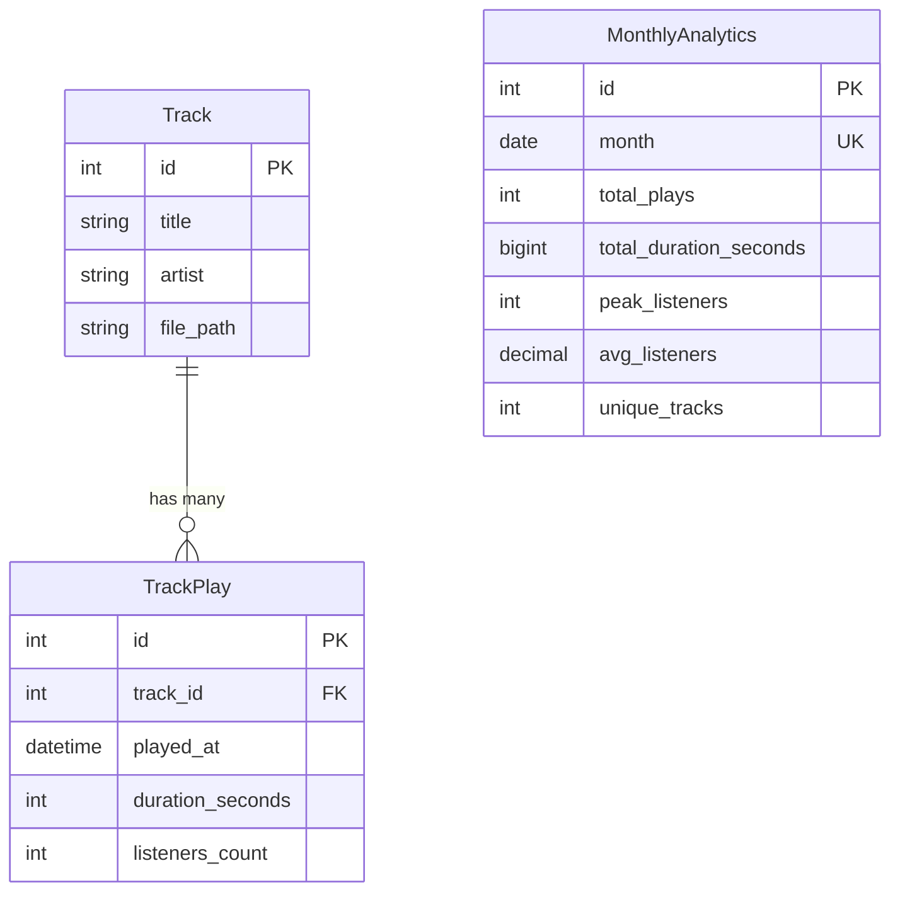

# Data Model: Admin Analytics Menu

**Feature**: 021-admin-analytics-menu  
**Date**: 2024-12-07  
**Status**: Complete

## Entities

### 1. TrackPlay

Запись о воспроизведении трека. Основной источник данных для аналитики.

**Таблица**: `track_plays`

| Поле | Тип | Nullable | Default | Описание |
|------|-----|----------|---------|----------|
| id | SERIAL | NO | auto | Primary key |
| track_id | INTEGER | NO | - | FK → tracks.id |
| played_at | TIMESTAMP | NO | NOW() | Время начала воспроизведения |
| duration_seconds | INTEGER | YES | NULL | Длительность воспроизведения |
| listeners_count | INTEGER | NO | - | Количество слушателей в момент воспроизведения |

**Индексы**:
- `idx_track_plays_played_at` ON (played_at) - для запросов по периоду
- `idx_track_plays_track_id` ON (track_id) - для топ треков

**Constraints**:
- `fk_track_plays_track` FOREIGN KEY (track_id) REFERENCES tracks(id) ON DELETE CASCADE

**SQLAlchemy модель**:
```python
from sqlalchemy import Column, Integer, DateTime, ForeignKey
from sqlalchemy.orm import relationship
from datetime import datetime
from src.database import Base

class TrackPlay(Base):
    __tablename__ = "track_plays"
    
    id = Column(Integer, primary_key=True, index=True)
    track_id = Column(Integer, ForeignKey("tracks.id", ondelete="CASCADE"), nullable=False, index=True)
    played_at = Column(DateTime, nullable=False, default=datetime.utcnow, index=True)
    duration_seconds = Column(Integer, nullable=True)
    listeners_count = Column(Integer, nullable=False)
    
    # Relationships
    track = relationship("Track", back_populates="plays")
```

---

### 2. MonthlyAnalytics

Агрегированные данные за месяц. Хранятся после того, как детальные данные удаляются (>90 дней).

**Таблица**: `monthly_analytics`

| Поле | Тип | Nullable | Default | Описание |
|------|-----|----------|---------|----------|
| id | SERIAL | NO | auto | Primary key |
| month | DATE | NO | - | Первый день месяца |
| total_plays | INTEGER | NO | - | Общее количество воспроизведений |
| total_duration_seconds | BIGINT | NO | - | Суммарное время вещания |
| peak_listeners | INTEGER | NO | - | Пиковое количество слушателей |
| avg_listeners | DECIMAL(10,2) | NO | - | Среднее количество слушателей |
| unique_tracks | INTEGER | NO | - | Количество уникальных треков |

**Constraints**:
- `uq_monthly_analytics_month` UNIQUE (month)

**SQLAlchemy модель**:
```python
from sqlalchemy import Column, Integer, BigInteger, Numeric, Date
from src.database import Base

class MonthlyAnalytics(Base):
    __tablename__ = "monthly_analytics"
    
    id = Column(Integer, primary_key=True, index=True)
    month = Column(Date, nullable=False, unique=True, index=True)
    total_plays = Column(Integer, nullable=False)
    total_duration_seconds = Column(BigInteger, nullable=False)
    peak_listeners = Column(Integer, nullable=False)
    avg_listeners = Column(Numeric(10, 2), nullable=False)
    unique_tracks = Column(Integer, nullable=False)
```

---

## API Response Schemas (Pydantic)

### ListenerStatsResponse

```python
from pydantic import BaseModel
from datetime import datetime
from typing import List, Optional

class ListenerStatsResponse(BaseModel):
    """Текущая статистика слушателей."""
    current: int
    peak_today: int
    peak_week: int
    average_week: float

class ListenerHistoryPoint(BaseModel):
    """Точка на графике истории слушателей."""
    timestamp: datetime
    count: int

class ListenerHistoryResponse(BaseModel):
    """История слушателей за период."""
    period: str  # "7d", "30d", "90d", "all"
    data: List[ListenerHistoryPoint]
```

### TopTracksResponse

```python
class TopTrackItem(BaseModel):
    """Трек в топе."""
    track_id: int
    title: str
    artist: Optional[str]
    play_count: int
    total_duration_seconds: int

class TopTracksResponse(BaseModel):
    """Топ треков за период."""
    period: str
    tracks: List[TopTrackItem]
```

### AnalyticsSummaryResponse

```python
class AnalyticsSummaryResponse(BaseModel):
    """Сводная статистика."""
    period: str
    total_plays: int
    total_duration_hours: float
    unique_tracks: int
    listeners: ListenerStatsResponse
    cached_at: datetime
```

---

## Миграция Alembic

**Файл**: `migrations/versions/xxx_add_track_plays.py`

```python
"""Add track_plays and monthly_analytics tables

Revision ID: xxx
Revises: [previous]
Create Date: 2024-12-07
"""
from alembic import op
import sqlalchemy as sa

revision = 'xxx'
down_revision = '[previous]'
branch_labels = None
depends_on = None

def upgrade():
    # Track plays table
    op.create_table(
        'track_plays',
        sa.Column('id', sa.Integer(), nullable=False),
        sa.Column('track_id', sa.Integer(), nullable=False),
        sa.Column('played_at', sa.DateTime(), nullable=False, server_default=sa.text('NOW()')),
        sa.Column('duration_seconds', sa.Integer(), nullable=True),
        sa.Column('listeners_count', sa.Integer(), nullable=False),
        sa.ForeignKeyConstraint(['track_id'], ['tracks.id'], ondelete='CASCADE'),
        sa.PrimaryKeyConstraint('id')
    )
    op.create_index('idx_track_plays_played_at', 'track_plays', ['played_at'])
    op.create_index('idx_track_plays_track_id', 'track_plays', ['track_id'])
    
    # Monthly analytics table
    op.create_table(
        'monthly_analytics',
        sa.Column('id', sa.Integer(), nullable=False),
        sa.Column('month', sa.Date(), nullable=False),
        sa.Column('total_plays', sa.Integer(), nullable=False),
        sa.Column('total_duration_seconds', sa.BigInteger(), nullable=False),
        sa.Column('peak_listeners', sa.Integer(), nullable=False),
        sa.Column('avg_listeners', sa.Numeric(10, 2), nullable=False),
        sa.Column('unique_tracks', sa.Integer(), nullable=False),
        sa.PrimaryKeyConstraint('id'),
        sa.UniqueConstraint('month', name='uq_monthly_analytics_month')
    )
    op.create_index('idx_monthly_analytics_month', 'monthly_analytics', ['month'])

def downgrade():
    op.drop_table('monthly_analytics')
    op.drop_table('track_plays')
```

---

## Relationships



---

## Validation Rules

### TrackPlay
- `track_id`: Должен ссылаться на существующий трек
- `listeners_count`: >= 0
- `duration_seconds`: >= 0 (если указано)
- `played_at`: Не может быть в будущем

### MonthlyAnalytics
- `month`: Первый день месяца (всегда 01)
- `total_plays`: >= 0
- `avg_listeners`: >= 0

---

## State Transitions

TrackPlay не имеет состояний — это immutable записи.

Данные проходят следующий lifecycle:
1. **Created**: Streamer записывает TrackPlay при воспроизведении
2. **Active**: Данные используются для расчёта статистики (0-90 дней)
3. **Archived**: Данные агрегируются в MonthlyAnalytics (>90 дней)
4. **Deleted**: Детальные записи удаляются после агрегации
