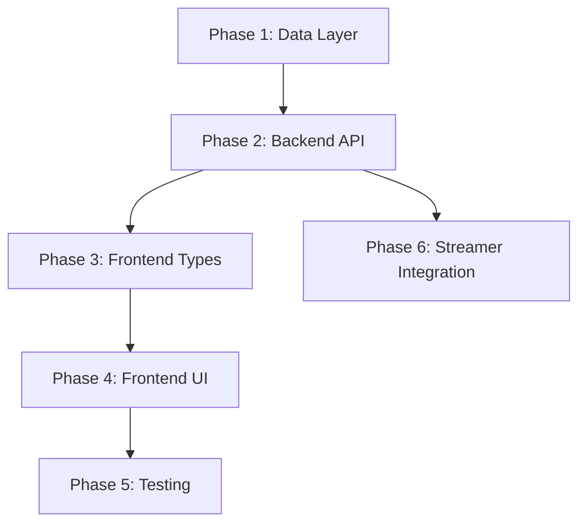

# Implementation Plan: Admin Analytics Menu

**Branch**: `021-admin-analytics-menu` | **Date**: 2024-12-07 | **Spec**: [spec.md](./spec.md)
**Input**: Feature specification from `/specs/021-admin-analytics-menu/spec.md`

## Summary

Добавление раздела "Аналитика" в админ-панель с RBAC-контролем доступа. Включает:
- Новый пункт меню с иконкой для ролей SUPERADMIN/ADMIN/MODERATOR
- Страницу дашборда с метриками слушателей и треков
- Backend API с защитой через `require_role`
- PostgreSQL хранение событий + 5-мин кеширование

## Technical Context

**Language/Version**: Python 3.11+ (backend), TypeScript 5.x (frontend)  
**Primary Dependencies**: FastAPI, SQLAlchemy 2.x, React 18.x, Recharts  
**Storage**: PostgreSQL (таблица `track_plays`), Redis (кеширование 5 мин)  
**Testing**: pytest (backend), vitest + playwright (frontend)  
**Target Platform**: Linux server (Docker), Web browser (SPA)  
**Project Type**: Web application (frontend + backend)  
**Performance Goals**: Страница загружается <2 сек, API ответ <200ms  
**Constraints**: Кеширование 5 мин, retention 90 дней + месячные агрегаты  
**Scale/Scope**: ~100-1000 активных слушателей, ~10k треков/месяц

## Constitution Check

*GATE: Must pass before Phase 0 research. Re-check after Phase 1 design.*

| Принцип | Статус | Комментарий |
|---------|--------|-------------|
| Простота | ✅ Pass | Используем существующие паттерны (RBAC, permissions) |
| Минимум зависимостей | ✅ Pass | Recharts — единственная новая зависимость |
| Чистая структура | ✅ Pass | Файлы в существующих директориях |
| Безопасность | ✅ Pass | RBAC через `require_role`, frontend проверка |
| Документация | ✅ Pass | Этот план + api docs |

## Project Structure

### Documentation (this feature)

```text
specs/021-admin-analytics-menu/
├── plan.md              # Этот файл
├── research.md          # Технические решения (Recharts, кеширование)
├── data-model.md        # Схема TrackPlay и агрегатов
├── quickstart.md        # Инструкция быстрого старта
├── contracts/           # OpenAPI контракты
│   └── openapi.yaml
└── tasks.md             # Задачи (/speckit.tasks)
```

### Source Code (repository root)

```text
backend/
├── src/
│   ├── api/
│   │   └── analytics.py        # NEW: API эндпоинты аналитики
│   ├── models/
│   │   └── track_play.py       # NEW: SQLAlchemy модель TrackPlay
│   ├── services/
│   │   └── analytics_service.py # NEW: Бизнес-логика аналитики
│   └── lib/
│       └── rbac.py             # MODIFY: analytics_view уже есть
├── migrations/
│   └── versions/
│       └── xxx_add_track_plays.py # NEW: Alembic миграция
└── tests/
    └── test_analytics.py       # NEW: Тесты API

frontend/
├── src/
│   ├── components/
│   │   └── analytics/          # NEW: Компоненты аналитики
│   │       ├── MetricCard.tsx
│   │       ├── ListenersChart.tsx
│   │       └── TopTracksTable.tsx
│   ├── pages/
│   │   └── admin/
│   │       └── Analytics.tsx   # NEW: Страница аналитики
│   ├── api/
│   │   └── analytics.ts        # NEW: API клиент
│   ├── types/
│   │   ├── permissions.ts      # MODIFY: +canViewAnalytics
│   │   └── analytics.ts        # NEW: Типы для аналитики
│   └── components/layout/
│       ├── DesktopNav.tsx      # MODIFY: +пункт Analytics
│       └── MobileNav.tsx       # MODIFY: +пункт Analytics
└── tests/
    └── analytics.spec.ts       # NEW: E2E тесты
```

**Structure Decision**: Используется существующая структура web application (Option 2). 
Все новые файлы добавляются в соответствующие директории без изменения архитектуры.

## Complexity Tracking

> Нарушений Constitution Check нет — дополнительное обоснование не требуется.

## Implementation Phases

### Phase 1: Backend Data Layer
- Alembic миграция для `track_plays`
- SQLAlchemy модель `TrackPlay`
- Сервис `analytics_service.py` с кешированием

### Phase 2: Backend API
- Эндпоинты в `analytics.py`
- RBAC через `require_role([SUPERADMIN, ADMIN, MODERATOR])`
- Схемы ответов Pydantic

### Phase 3: Frontend Types & API
- Типы в `types/analytics.ts`
- API клиент `api/analytics.ts`
- Добавить `canViewAnalytics` в permissions

### Phase 4: Frontend UI
- Компоненты MetricCard, ListenersChart, TopTracksTable
- Страница `Analytics.tsx`
- Навигация в DesktopNav/MobileNav

### Phase 5: Integration & Testing
- Backend тесты (pytest)
- Frontend тесты (vitest)
- E2E тесты (playwright)

### Phase 6: Streamer Integration
- Интеграция записи TrackPlay из streamer
- Документация

## Dependencies


